# 1. Project set-up and Model diagram

|  |

# 2. Software

|  | 

## 2.1 Importing libraries (preparaing the tools)


```python
# Regular EDA and plotting libraries
import numpy as np # np is short for numpy
import pandas as pd # pandas is so commonly used, it's shortened to pd
import matplotlib.pyplot as plt
import seaborn as sns # seaborn gets shortened to sns
from importlib import reload
import matplotlib._color_data as mcd

# We want our plots to appear in the notebook
%matplotlib inline 

## Models
from sklearn.preprocessing import StandardScaler # to standardizes the features
from sklearn.linear_model import LogisticRegression # Logistic Regression model
from sklearn.neighbors import KNeighborsClassifier # K-nearest neighbour model
from sklearn.ensemble import RandomForestClassifier # Random forest model
from sklearn.tree import DecisionTreeClassifier # Decision Tree model
from sklearn.svm import SVC # Support Vector Machines (SVM) model
from sklearn.naive_bayes import GaussianNB # Naïve Bayes model

from sklearn.pipeline import Pipeline


## Model evaluators
from sklearn.model_selection import train_test_split, cross_val_score
from sklearn.model_selection import RandomizedSearchCV, GridSearchCV
from sklearn.metrics import confusion_matrix, classification_report , ConfusionMatrixDisplay
from sklearn.metrics import precision_score, recall_score, f1_score
from sklearn.metrics import plot_roc_curve, roc_auc_score, roc_curve
from sklearn.metrics import accuracy_score
```


```python

```

 # 3. Dataset

## 3.1 Load the Dataset


```python
# Load Pima Indians Dataset
df = pd.read_csv("data/diabetes.csv") # 'DataFrame' shortened to 'df'
```

## 3.2 Exploratory Data Analysis (EAD)

### 3.2.1 understanding your variables

 #### 3.2.1.1 Head of the Dataset


```python
df.head()
```


<div>
<style scoped>
    .dataframe tbody tr th:only-of-type {
        vertical-align: middle;
    }

    .dataframe tbody tr th {
        vertical-align: top;
    }

    .dataframe thead th {
        text-align: right;
    }
</style>
<table border="1" class="dataframe">
  <thead>
    <tr style="text-align: right;">
      <th></th>
      <th>Pregnancies</th>
      <th>Glucose</th>
      <th>BloodPressure</th>
      <th>SkinThickness</th>
      <th>Insulin</th>
      <th>BMI</th>
      <th>DiabetesPedigreeFunction</th>
      <th>Age</th>
      <th>Outcome</th>
    </tr>
  </thead>
  <tbody>
    <tr>
      <th>0</th>
      <td>6</td>
      <td>148</td>
      <td>72</td>
      <td>35</td>
      <td>0</td>
      <td>33.6</td>
      <td>0.627</td>
      <td>50</td>
      <td>1</td>
    </tr>
    <tr>
      <th>1</th>
      <td>1</td>
      <td>85</td>
      <td>66</td>
      <td>29</td>
      <td>0</td>
      <td>26.6</td>
      <td>0.351</td>
      <td>31</td>
      <td>0</td>
    </tr>
    <tr>
      <th>2</th>
      <td>8</td>
      <td>183</td>
      <td>64</td>
      <td>0</td>
      <td>0</td>
      <td>23.3</td>
      <td>0.672</td>
      <td>32</td>
      <td>1</td>
    </tr>
    <tr>
      <th>3</th>
      <td>1</td>
      <td>89</td>
      <td>66</td>
      <td>23</td>
      <td>94</td>
      <td>28.1</td>
      <td>0.167</td>
      <td>21</td>
      <td>0</td>
    </tr>
    <tr>
      <th>4</th>
      <td>0</td>
      <td>137</td>
      <td>40</td>
      <td>35</td>
      <td>168</td>
      <td>43.1</td>
      <td>2.288</td>
      <td>33</td>
      <td>1</td>
    </tr>
  </tbody>
</table>
</div>


```python
df.tail()
```


<div>
<style scoped>
    .dataframe tbody tr th:only-of-type {
        vertical-align: middle;
    }

    .dataframe tbody tr th {
        vertical-align: top;
    }

    .dataframe thead th {
        text-align: right;
    }
</style>
<table border="1" class="dataframe">
  <thead>
    <tr style="text-align: right;">
      <th></th>
      <th>Pregnancies</th>
      <th>Glucose</th>
      <th>BloodPressure</th>
      <th>SkinThickness</th>
      <th>Insulin</th>
      <th>BMI</th>
      <th>DiabetesPedigreeFunction</th>
      <th>Age</th>
      <th>Outcome</th>
    </tr>
  </thead>
  <tbody>
    <tr>
      <th>763</th>
      <td>10</td>
      <td>101</td>
      <td>76</td>
      <td>48</td>
      <td>180</td>
      <td>32.9</td>
      <td>0.171</td>
      <td>63</td>
      <td>0</td>
    </tr>
    <tr>
      <th>764</th>
      <td>2</td>
      <td>122</td>
      <td>70</td>
      <td>27</td>
      <td>0</td>
      <td>36.8</td>
      <td>0.340</td>
      <td>27</td>
      <td>0</td>
    </tr>
    <tr>
      <th>765</th>
      <td>5</td>
      <td>121</td>
      <td>72</td>
      <td>23</td>
      <td>112</td>
      <td>26.2</td>
      <td>0.245</td>
      <td>30</td>
      <td>0</td>
    </tr>
    <tr>
      <th>766</th>
      <td>1</td>
      <td>126</td>
      <td>60</td>
      <td>0</td>
      <td>0</td>
      <td>30.1</td>
      <td>0.349</td>
      <td>47</td>
      <td>1</td>
    </tr>
    <tr>
      <th>767</th>
      <td>1</td>
      <td>93</td>
      <td>70</td>
      <td>31</td>
      <td>0</td>
      <td>30.4</td>
      <td>0.315</td>
      <td>23</td>
      <td>0</td>
    </tr>
  </tbody>
</table>
</div>


```python
# display randomly any number of records
df.sample(10)
```


<div>
<style scoped>
    .dataframe tbody tr th:only-of-type {
        vertical-align: middle;
    }

    .dataframe tbody tr th {
        vertical-align: top;
    }

    .dataframe thead th {
        text-align: right;
    }
</style>
<table border="1" class="dataframe">
  <thead>
    <tr style="text-align: right;">
      <th></th>
      <th>Pregnancies</th>
      <th>Glucose</th>
      <th>BloodPressure</th>
      <th>SkinThickness</th>
      <th>Insulin</th>
      <th>BMI</th>
      <th>DiabetesPedigreeFunction</th>
      <th>Age</th>
      <th>Outcome</th>
    </tr>
  </thead>
  <tbody>
    <tr>
      <th>426</th>
      <td>0</td>
      <td>94</td>
      <td>0</td>
      <td>0</td>
      <td>0</td>
      <td>0.0</td>
      <td>0.256</td>
      <td>25</td>
      <td>0</td>
    </tr>
    <tr>
      <th>166</th>
      <td>3</td>
      <td>148</td>
      <td>66</td>
      <td>25</td>
      <td>0</td>
      <td>32.5</td>
      <td>0.256</td>
      <td>22</td>
      <td>0</td>
    </tr>
    <tr>
      <th>275</th>
      <td>2</td>
      <td>100</td>
      <td>70</td>
      <td>52</td>
      <td>57</td>
      <td>40.5</td>
      <td>0.677</td>
      <td>25</td>
      <td>0</td>
    </tr>
    <tr>
      <th>728</th>
      <td>2</td>
      <td>175</td>
      <td>88</td>
      <td>0</td>
      <td>0</td>
      <td>22.9</td>
      <td>0.326</td>
      <td>22</td>
      <td>0</td>
    </tr>
    <tr>
      <th>623</th>
      <td>0</td>
      <td>94</td>
      <td>70</td>
      <td>27</td>
      <td>115</td>
      <td>43.5</td>
      <td>0.347</td>
      <td>21</td>
      <td>0</td>
    </tr>
    <tr>
      <th>254</th>
      <td>12</td>
      <td>92</td>
      <td>62</td>
      <td>7</td>
      <td>258</td>
      <td>27.6</td>
      <td>0.926</td>
      <td>44</td>
      <td>1</td>
    </tr>
    <tr>
      <th>331</th>
      <td>2</td>
      <td>87</td>
      <td>58</td>
      <td>16</td>
      <td>52</td>
      <td>32.7</td>
      <td>0.166</td>
      <td>25</td>
      <td>0</td>
    </tr>
    <tr>
      <th>193</th>
      <td>11</td>
      <td>135</td>
      <td>0</td>
      <td>0</td>
      <td>0</td>
      <td>52.3</td>
      <td>0.578</td>
      <td>40</td>
      <td>1</td>
    </tr>
    <tr>
      <th>564</th>
      <td>0</td>
      <td>91</td>
      <td>80</td>
      <td>0</td>
      <td>0</td>
      <td>32.4</td>
      <td>0.601</td>
      <td>27</td>
      <td>0</td>
    </tr>
    <tr>
      <th>17</th>
      <td>7</td>
      <td>107</td>
      <td>74</td>
      <td>0</td>
      <td>0</td>
      <td>29.6</td>
      <td>0.254</td>
      <td>31</td>
      <td>1</td>
    </tr>
  </tbody>
</table>
</div>


 #### 3.2.1.2 shape of the Dataset


```python
# number of rows and columns
df.shape
```


    (768, 9)


 #### 3.2.1.3 List type of all columns 


```python
# list the types of all columns
df.dtypes
```


    Pregnancies                   int64
    Glucose                       int64
    BloodPressure                 int64
    SkinThickness                 int64
    Insulin                       int64
    BMI                         float64
    DiabetesPedigreeFunction    float64
    Age                           int64
    Outcome                       int64
    dtype: object


 #### 3.2.1.4 info of the Dataset


```python
# finding out if the dataset contains any null value
df.info()
```

    <class 'pandas.core.frame.DataFrame'>
    RangeIndex: 768 entries, 0 to 767
    Data columns (total 9 columns):
     #   Column                    Non-Null Count  Dtype  
    ---  ------                    --------------  -----  
     0   Pregnancies               768 non-null    int64  
     1   Glucose                   768 non-null    int64  
     2   BloodPressure             768 non-null    int64  
     3   SkinThickness             768 non-null    int64  
     4   Insulin                   768 non-null    int64  
     5   BMI                       768 non-null    float64
     6   DiabetesPedigreeFunction  768 non-null    float64
     7   Age                       768 non-null    int64  
     8   Outcome                   768 non-null    int64  
    dtypes: float64(2), int64(7)
    memory usage: 54.1 KB


 #### 3.2.1.5 Summary of the Dataset


```python
 # statistical summary 
df.describe()
```


<div>
<style scoped>
    .dataframe tbody tr th:only-of-type {
        vertical-align: middle;
    }

    .dataframe tbody tr th {
        vertical-align: top;
    }

    .dataframe thead th {
        text-align: right;
    }
</style>
<table border="1" class="dataframe">
  <thead>
    <tr style="text-align: right;">
      <th></th>
      <th>Pregnancies</th>
      <th>Glucose</th>
      <th>BloodPressure</th>
      <th>SkinThickness</th>
      <th>Insulin</th>
      <th>BMI</th>
      <th>DiabetesPedigreeFunction</th>
      <th>Age</th>
      <th>Outcome</th>
    </tr>
  </thead>
  <tbody>
    <tr>
      <th>count</th>
      <td>768.000000</td>
      <td>768.000000</td>
      <td>768.000000</td>
      <td>768.000000</td>
      <td>768.000000</td>
      <td>768.000000</td>
      <td>768.000000</td>
      <td>768.000000</td>
      <td>768.000000</td>
    </tr>
    <tr>
      <th>mean</th>
      <td>3.845052</td>
      <td>120.894531</td>
      <td>69.105469</td>
      <td>20.536458</td>
      <td>79.799479</td>
      <td>31.992578</td>
      <td>0.471876</td>
      <td>33.240885</td>
      <td>0.348958</td>
    </tr>
    <tr>
      <th>std</th>
      <td>3.369578</td>
      <td>31.972618</td>
      <td>19.355807</td>
      <td>15.952218</td>
      <td>115.244002</td>
      <td>7.884160</td>
      <td>0.331329</td>
      <td>11.760232</td>
      <td>0.476951</td>
    </tr>
    <tr>
      <th>min</th>
      <td>0.000000</td>
      <td>0.000000</td>
      <td>0.000000</td>
      <td>0.000000</td>
      <td>0.000000</td>
      <td>0.000000</td>
      <td>0.078000</td>
      <td>21.000000</td>
      <td>0.000000</td>
    </tr>
    <tr>
      <th>25%</th>
      <td>1.000000</td>
      <td>99.000000</td>
      <td>62.000000</td>
      <td>0.000000</td>
      <td>0.000000</td>
      <td>27.300000</td>
      <td>0.243750</td>
      <td>24.000000</td>
      <td>0.000000</td>
    </tr>
    <tr>
      <th>50%</th>
      <td>3.000000</td>
      <td>117.000000</td>
      <td>72.000000</td>
      <td>23.000000</td>
      <td>30.500000</td>
      <td>32.000000</td>
      <td>0.372500</td>
      <td>29.000000</td>
      <td>0.000000</td>
    </tr>
    <tr>
      <th>75%</th>
      <td>6.000000</td>
      <td>140.250000</td>
      <td>80.000000</td>
      <td>32.000000</td>
      <td>127.250000</td>
      <td>36.600000</td>
      <td>0.626250</td>
      <td>41.000000</td>
      <td>1.000000</td>
    </tr>
    <tr>
      <th>max</th>
      <td>17.000000</td>
      <td>199.000000</td>
      <td>122.000000</td>
      <td>99.000000</td>
      <td>846.000000</td>
      <td>67.100000</td>
      <td>2.420000</td>
      <td>81.000000</td>
      <td>1.000000</td>
    </tr>
  </tbody>
</table>
</div>


```python
# Let's see how many positive (1) and negative (0) samples we have in our dataframe
df.Outcome.value_counts()
```


    0    500
    1    268
    Name: Outcome, dtype: int64


 ### 3.2.2 Data Cleaning

#### 3.2.2.1 Check the duplicates


```python
# check the shape before drop the duplicate 
df.shape
```


    (768, 9)


```python
df=df.drop_duplicates()
```


```python
# check the shape after drop the duplicate 
df.shape
```


    (768, 9)


#### 3.2.2.1 Check the Null values (handling missing data)


```python
# count of any NULL valus
# check the missing valuse in any columns
df.isnull().sum()
```


    Pregnancies                 0
    Glucose                     0
    BloodPressure               0
    SkinThickness               0
    Insulin                     0
    BMI                         0
    DiabetesPedigreeFunction    0
    Age                         0
    Outcome                     0
    dtype: int64


```python
data_copy = df.copy(deep=True)
df.columns
```


    Index(['Pregnancies', 'Glucose', 'BloodPressure', 'SkinThickness', 'Insulin',
           'BMI', 'DiabetesPedigreeFunction', 'Age', 'Outcome'],
          dtype='object')


```python
# check the number of Zero values in dataset
data_copy[['Glucose', 'BloodPressure', 'SkinThickness', 'Insulin',
       'BMI']] = data_copy[['Glucose', 'BloodPressure', 'SkinThickness', 'Insulin',
       'BMI']].replace(0,np.nan)
```


```python
data_copy.isnull().sum()
```


    Pregnancies                   0
    Glucose                       5
    BloodPressure                35
    SkinThickness               227
    Insulin                     374
    BMI                          11
    DiabetesPedigreeFunction      0
    Age                           0
    Outcome                       0
    dtype: int64


```python
# replace any 0 valye with the mean value
# replace number of zero values with the minimum of that column. 
df['Glucose'] = df['Glucose'].replace(0,df['Glucose'].mean())
df['BloodPressure'] = df['BloodPressure'].replace(0,df['BloodPressure'].mean())
df['SkinThickness'] = df['SkinThickness'].replace(0,df['SkinThickness'].mean())
df['Insulin'] = df['Insulin'].replace(0,df['Insulin'].mean())
df['BMI'] = df['BMI'].replace(0,df['BMI'].mean())
```


```python
# there is no missing value in dataset
df.describe()
```


<div>
<style scoped>
    .dataframe tbody tr th:only-of-type {
        vertical-align: middle;
    }

    .dataframe tbody tr th {
        vertical-align: top;
    }

    .dataframe thead th {
        text-align: right;
    }
</style>
<table border="1" class="dataframe">
  <thead>
    <tr style="text-align: right;">
      <th></th>
      <th>Pregnancies</th>
      <th>Glucose</th>
      <th>BloodPressure</th>
      <th>SkinThickness</th>
      <th>Insulin</th>
      <th>BMI</th>
      <th>DiabetesPedigreeFunction</th>
      <th>Age</th>
      <th>Outcome</th>
    </tr>
  </thead>
  <tbody>
    <tr>
      <th>count</th>
      <td>768.000000</td>
      <td>768.000000</td>
      <td>768.000000</td>
      <td>768.000000</td>
      <td>768.000000</td>
      <td>768.000000</td>
      <td>768.000000</td>
      <td>768.000000</td>
      <td>768.000000</td>
    </tr>
    <tr>
      <th>mean</th>
      <td>3.845052</td>
      <td>121.681605</td>
      <td>72.254807</td>
      <td>26.606479</td>
      <td>118.660163</td>
      <td>32.450805</td>
      <td>0.471876</td>
      <td>33.240885</td>
      <td>0.348958</td>
    </tr>
    <tr>
      <th>std</th>
      <td>3.369578</td>
      <td>30.436016</td>
      <td>12.115932</td>
      <td>9.631241</td>
      <td>93.080358</td>
      <td>6.875374</td>
      <td>0.331329</td>
      <td>11.760232</td>
      <td>0.476951</td>
    </tr>
    <tr>
      <th>min</th>
      <td>0.000000</td>
      <td>44.000000</td>
      <td>24.000000</td>
      <td>7.000000</td>
      <td>14.000000</td>
      <td>18.200000</td>
      <td>0.078000</td>
      <td>21.000000</td>
      <td>0.000000</td>
    </tr>
    <tr>
      <th>25%</th>
      <td>1.000000</td>
      <td>99.750000</td>
      <td>64.000000</td>
      <td>20.536458</td>
      <td>79.799479</td>
      <td>27.500000</td>
      <td>0.243750</td>
      <td>24.000000</td>
      <td>0.000000</td>
    </tr>
    <tr>
      <th>50%</th>
      <td>3.000000</td>
      <td>117.000000</td>
      <td>72.000000</td>
      <td>23.000000</td>
      <td>79.799479</td>
      <td>32.000000</td>
      <td>0.372500</td>
      <td>29.000000</td>
      <td>0.000000</td>
    </tr>
    <tr>
      <th>75%</th>
      <td>6.000000</td>
      <td>140.250000</td>
      <td>80.000000</td>
      <td>32.000000</td>
      <td>127.250000</td>
      <td>36.600000</td>
      <td>0.626250</td>
      <td>41.000000</td>
      <td>1.000000</td>
    </tr>
    <tr>
      <th>max</th>
      <td>17.000000</td>
      <td>199.000000</td>
      <td>122.000000</td>
      <td>99.000000</td>
      <td>846.000000</td>
      <td>67.100000</td>
      <td>2.420000</td>
      <td>81.000000</td>
      <td>1.000000</td>
    </tr>
  </tbody>
</table>
</div>


#### 3.2.2.3 Feature Engineering

#### 3.2.2.4 Converting non-numerical values to numerical values (also call feature encoding)
# 

# 


### 3.2.3 Data visualization

#### 3.2.3.1 Count Plot


```python
# Outcome count plot
f,ax=plt.subplots(1,2,figsize=(10,5))
df['Outcome'].value_counts().plot.pie(explode=[0,0.1],autopct='%1.1f%%',ax=ax[0],shadow=True)
ax[0].set_title('Outcome')
ax[0].set_ylabel('')
sns.countplot('Outcome',data=df,ax=ax[1])
ax[1].set_title('Outcome')
N,P = df['Outcome'].value_counts()
print("Negative (0): ", N) 
print("Positive (1): ", P) 
plt.grid()
plt.show()
```

    /Users/hosseinalishah/opt/anaconda3/lib/python3.9/site-packages/seaborn/_decorators.py:36: FutureWarning: Pass the following variable as a keyword arg: x. From version 0.12, the only valid positional argument will be `data`, and passing other arguments without an explicit keyword will result in an error or misinterpretation.
      warnings.warn(


    Negative (0):  500
    Positive (1):  268


    
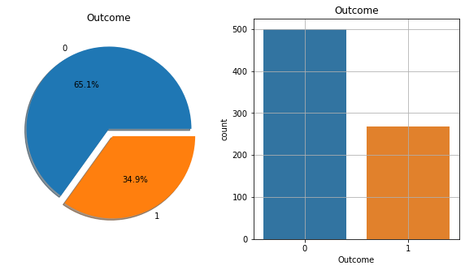
    


The countplot tells us thet the dataset in **imbalanced**, as number of patients who don't have diabetes is more than those who have diabetes.


```python

```

#### 3.2.3.2 Histograms


```python
# Histograma of each feature 
df.hist(bins=10, figsize=(10,10))
plt.show()
```


    
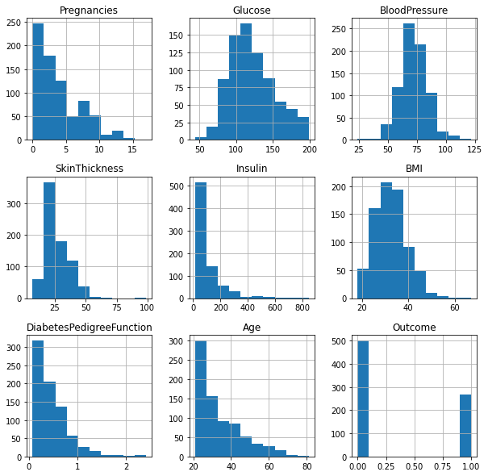
    


#### 3.2.3.3 Scatter plot


```python
# Scatter plot matrix
from pandas.plotting import scatter_matrix
scatter_matrix(df, figsize =(20,20));
```


    
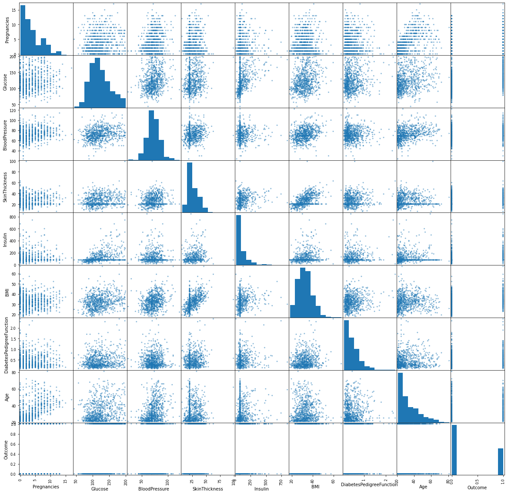
    


#### 3.2.3.4 Pairplot


```python
# pairplot
sns.pairplot(data = df, hue='Outcome')
plt.show()
```


    
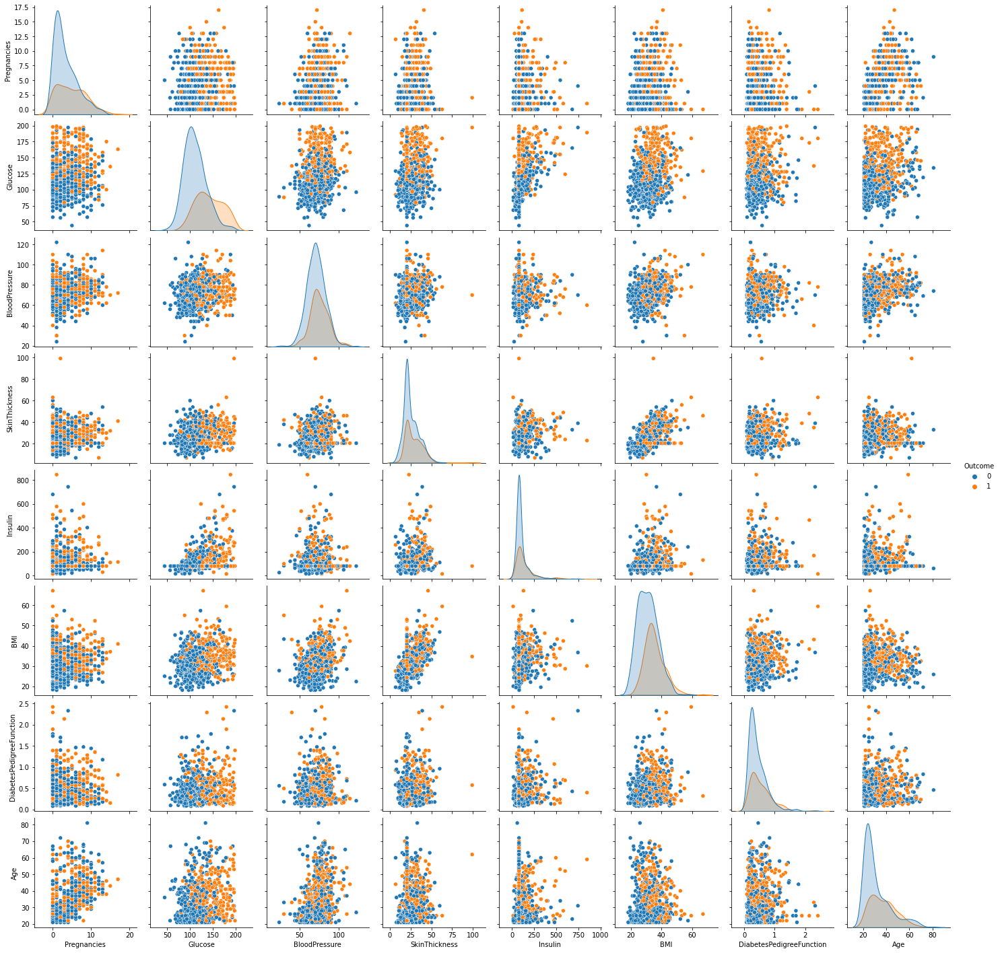
    


#### 3.2.3.5 Analyzing Relationships between variables

#### Correlation Analysis:
* It is used to quantified the degree to which two variables are related. Through the correlation analysis, you evaluate correlation coefficient that tell you how much one variable changes when the other one does. Correlation analysis provide you with linear relation between two variables. 
* When we correlate feature variables with the target variable, we get to know that how much dependency is there between particular feature variables and target variable. 


```python
# get correlation of each features in datasets 
corrmat = df.corr()
top_corr_feature = corrmat.index
plt.figure(figsize=(10,10))
# plot heatmap
g = sns.heatmap(df[top_corr_feature].corr(), annot=True, cmap='YlGnBu')
```


    
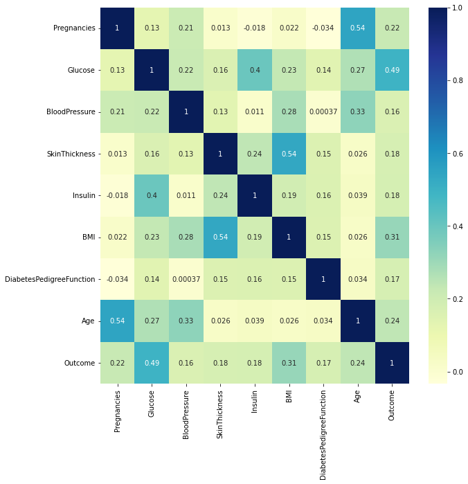
    


# 4. machine learning model

## 4.1 Split the Data Frame into X & y


```python
# Everything except target variable
X = df.drop("Outcome", axis=1)

# Target variable/ Outcome
y = df["Outcome"]
```


```python
# Independent variables (no target column)
X.head()
```


<div>
<style scoped>
    .dataframe tbody tr th:only-of-type {
        vertical-align: middle;
    }

    .dataframe tbody tr th {
        vertical-align: top;
    }

    .dataframe thead th {
        text-align: right;
    }
</style>
<table border="1" class="dataframe">
  <thead>
    <tr style="text-align: right;">
      <th></th>
      <th>Pregnancies</th>
      <th>Glucose</th>
      <th>BloodPressure</th>
      <th>SkinThickness</th>
      <th>Insulin</th>
      <th>BMI</th>
      <th>DiabetesPedigreeFunction</th>
      <th>Age</th>
    </tr>
  </thead>
  <tbody>
    <tr>
      <th>0</th>
      <td>6</td>
      <td>148.0</td>
      <td>72.0</td>
      <td>35.000000</td>
      <td>79.799479</td>
      <td>33.6</td>
      <td>0.627</td>
      <td>50</td>
    </tr>
    <tr>
      <th>1</th>
      <td>1</td>
      <td>85.0</td>
      <td>66.0</td>
      <td>29.000000</td>
      <td>79.799479</td>
      <td>26.6</td>
      <td>0.351</td>
      <td>31</td>
    </tr>
    <tr>
      <th>2</th>
      <td>8</td>
      <td>183.0</td>
      <td>64.0</td>
      <td>20.536458</td>
      <td>79.799479</td>
      <td>23.3</td>
      <td>0.672</td>
      <td>32</td>
    </tr>
    <tr>
      <th>3</th>
      <td>1</td>
      <td>89.0</td>
      <td>66.0</td>
      <td>23.000000</td>
      <td>94.000000</td>
      <td>28.1</td>
      <td>0.167</td>
      <td>21</td>
    </tr>
    <tr>
      <th>4</th>
      <td>0</td>
      <td>137.0</td>
      <td>40.0</td>
      <td>35.000000</td>
      <td>168.000000</td>
      <td>43.1</td>
      <td>2.288</td>
      <td>33</td>
    </tr>
  </tbody>
</table>
</div>


```python
# Targets/ Outcome
y.head()
```


    0    1
    1    0
    2    1
    3    0
    4    1
    Name: Outcome, dtype: int64


## 4.2 Apply feature scaling  
> Inplace of Standard scaler you have to try other data scaling techniques like normalizer, manmax scaler, and binarizer

### 4.2.1 Standard scaler


```python
scaler = StandardScaler()
scaler.fit(X) 
SSX = scaler.transform(X)
```


```python
SSX
```


    array([[ 0.63994726,  0.86527574, -0.0210444 , ...,  0.16725546,
             0.46849198,  1.4259954 ],
           [-0.84488505, -1.20598931, -0.51658286, ..., -0.85153454,
            -0.36506078, -0.19067191],
           [ 1.23388019,  2.01597855, -0.68176235, ..., -1.33182125,
             0.60439732, -0.10558415],
           ...,
           [ 0.3429808 , -0.02240928, -0.0210444 , ..., -0.90975111,
            -0.68519336, -0.27575966],
           [-0.84488505,  0.14197684, -1.01212132, ..., -0.34213954,
            -0.37110101,  1.17073215],
           [-0.84488505, -0.94297153, -0.18622389, ..., -0.29847711,
            -0.47378505, -0.87137393]])


# 
# 
## 4.3 Train test split


```python
# Random seed for reproducibility
np.random.seed(42)

X_train, X_test, y_train, y_test = train_test_split(SSX, 
                                                    y,
                                                    test_size = 0.2) 
X_train.shape, y_train.shape
```


    ((614, 8), (614,))


```python
X_test.shape, y_test.shape
```


    ((154, 8), (154,))


## 4.4 Build the classification algorithms


```python
#Logistic Regression
lr = LogisticRegression()
lr.fit(X_train, y_train)
```


    LogisticRegression()


```python
# K-Nearest Neighbors (KNN)
knn=KNeighborsClassifier()
knn.fit(X_train, y_train)
```


    KNeighborsClassifier()


```python
#Naíve Bayes
nb=GaussianNB()
nb.fit(X_train, y_train)
```


    GaussianNB()


```python
# Support Vector Machine (SVM)
svm=SVC()
svm.fit(X_train, y_train)
```


    SVC()


```python
# Random Forest 
rf=RandomForestClassifier()
rf.fit(X_train, y_train)
```


    RandomForestClassifier()


```python
# Decison Tree
dt=DecisionTreeClassifier()
dt.fit(X_train, y_train)
```


    DecisionTreeClassifier()


### Making Prediction by predict() function


```python
# making predictions on test dataset

#Logistic Regression
lr_pred=lr.predict(X_test)

# K-Nearest Neighbors (KNN)
knn_pred=knn.predict(X_test)

#Naíve Bayes
nb_pred=nb.predict(X_test)

# Support Vector Machine (SVM)
svm_pred=svm.predict(X_test)

# Random Forest 
rf_pred=rf.predict(X_test)

# Decison Tree
dt_pred=dt.predict(X_test)
```

# 5. Model Evaluation:

## 5.1 Train Score and test score


```python
#Logistic Regression
print("Train Accuracy of Logistic Regression: ", lr.score(X_train, y_train)*100)
print("1. Accuracy (Test) score of Logistic Regression: ", lr.score(X_test, y_test)*100)
print("2. Accuracy (Test) score of Logistic Regression: ", accuracy_score(y_test, lr_pred)*100)
```

    Train Accuracy of Logistic Regression:  77.0358306188925
    1. Accuracy (Test) score of Logistic Regression:  76.62337662337663
    2. Accuracy (Test) score of Logistic Regression:  76.62337662337663


```python
# K-Nearest Neighbors (KNN)
print("Train Accuracy of K-Nearest Neighbors: ", knn.score(X_train, y_train)*100)
print("1. Accuracy (Test) score of K-Nearest Neighbors: ", knn.score(X_test, y_test)*100)
print("2. Accuracy (Test) score of K-Nearest Neighbors: ", accuracy_score(y_test, knn_pred)*100)
```

    Train Accuracy of K-Nearest Neighbors:  83.22475570032573
    1. Accuracy (Test) score of K-Nearest Neighbors:  76.62337662337663
    2. Accuracy (Test) score of K-Nearest Neighbors:  76.62337662337663


```python
#Naíve Bayes
print("Train Accuracy of Naíve Bayes: ", nb.score(X_train, y_train)*100)
print("1. Accuracy (Test) score of Naíve Bayes: ", nb.score(X_test, y_test)*100)
print("2. Accuracy (Test) score of Naíve Bayes: ", accuracy_score(y_test, nb_pred)*100)
```

    Train Accuracy of Naíve Bayes:  74.1042345276873
    1. Accuracy (Test) score of Naíve Bayes:  75.32467532467533
    2. Accuracy (Test) score of Naíve Bayes:  75.32467532467533


```python
# Support Vector Machine (SVM)
print("Train Accuracy of SVM: ", svm.score(X_train, y_train)*100)
print("1. Accuracy (Test) score of SVM: ", svm.score(X_test, y_test)*100)
print("2. Accuracy (Test) score of SVM: ", accuracy_score(y_test, svm_pred)*100)
```

    Train Accuracy of SVM:  82.41042345276874
    1. Accuracy (Test) score of SVM:  74.02597402597402
    2. Accuracy (Test) score of SVM:  74.02597402597402


```python
# Random Forest 
print("Train Accuracy of Logistic Regression: ", rf.score(X_train, y_train)*100)
print("1. Accuracy (Test) score of Random Forest: ", rf.score(X_test, y_test)*100)
print("2. Accuracy (Test) score of Random Forest: ", accuracy_score(y_test, rf_pred)*100)
```

    Train Accuracy of Logistic Regression:  100.0
    1. Accuracy (Test) score of Random Forest:  74.02597402597402
    2. Accuracy (Test) score of Random Forest:  74.02597402597402


```python
# Decison Tree
print("Train Accuracy of Decison Tree: ", dt.score(X_train, y_train)*100)
print("1. Accuracy (Test) score of Decison Tree: ", dt.score(X_test, y_test)*100)
print("2. Accuracy (Test) score of Decison Tree: ", accuracy_score(y_test, dt_pred)*100)
```

    Train Accuracy of Decison Tree:  100.0
    1. Accuracy (Test) score of Decison Tree:  72.72727272727273
    2. Accuracy (Test) score of Decison Tree:  72.72727272727273


### 5.1.1 Model Comparison


```python
models_Accuracy = {
          "KNN": accuracy_score(y_test, knn_pred)*100,
          "Logistic Regression": accuracy_score(y_test, lr_pred)*100, 
          "Random Forest": accuracy_score(y_test, rf_pred)*100,
          "Decision Tree": accuracy_score(y_test, dt_pred)*100,
          "SVM": accuracy_score(y_test, svm_pred)*100,
          "Naive Bayes":accuracy_score(y_test, nb_pred)*100}
```


```python
model_compare = pd.DataFrame(models_Accuracy, index=['accuracy'])
model_compare.T.plot.bar();
```


    
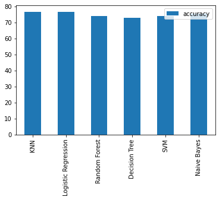
    


```python
model_compare
```


<div>
<style scoped>
    .dataframe tbody tr th:only-of-type {
        vertical-align: middle;
    }

    .dataframe tbody tr th {
        vertical-align: top;
    }

    .dataframe thead th {
        text-align: right;
    }
</style>
<table border="1" class="dataframe">
  <thead>
    <tr style="text-align: right;">
      <th></th>
      <th>KNN</th>
      <th>Logistic Regression</th>
      <th>Random Forest</th>
      <th>Decision Tree</th>
      <th>SVM</th>
      <th>Naive Bayes</th>
    </tr>
  </thead>
  <tbody>
    <tr>
      <th>accuracy</th>
      <td>76.623377</td>
      <td>76.623377</td>
      <td>74.025974</td>
      <td>72.727273</td>
      <td>74.025974</td>
      <td>75.324675</td>
    </tr>
  </tbody>
</table>
</div>


# Improving model predictions through experimentation
We'll be using this setup to tune the hyperparameters of some of our models and then evaluate them. We'll also get a few more metrics like **precision**, **recall**, **F1-score** and **ROC** at the same time.

Here's the game plan:
1. Tune model hyperparameters, see which performs best
2. Perform cross-validation
3. Plot ROC curves
4. Make a confusion matrix
5. Get precision, recall and F1-score metrics
6. Find the most important model features

# 5.2 Hyperparameter tuning and cross-validation

- You can use the same algorithms but change the settings (hyperparameters) and get different results.
- You change the settings and it works so well, it **** (does too well) the data.
- To test different hyperparameters, you could use a **validation set** but since we don't have much data, we'll use **cross-validation**.
- The most common type of cross-validation is *k-fold*. It involves splitting your data into *k-fold's* and then testing a model on each. For example, let's say we had 5 folds (k = 5). This what it might look like.
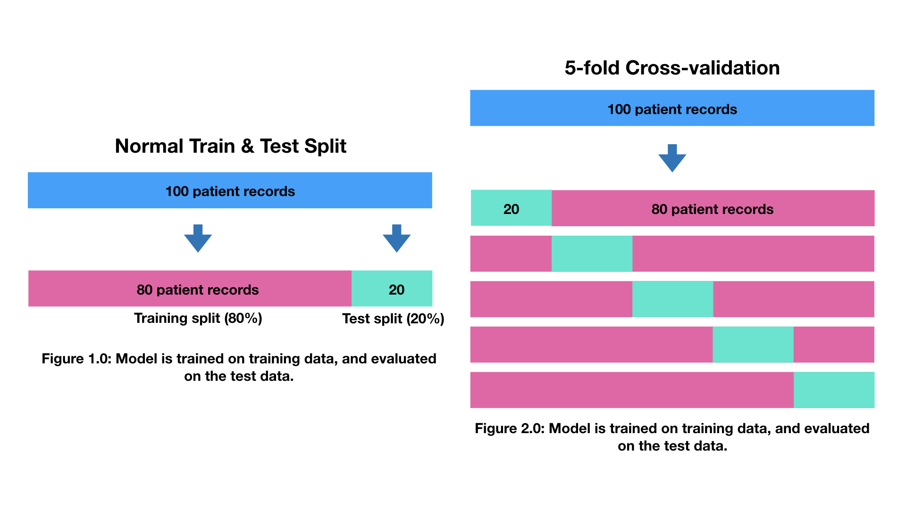

## 5.2.1 Tune KNeighborsClassifier (K-Nearest Neighbors or KNN) by hand
There's one main hyperparameter we can tune for the K-Nearest Neighbors (KNN) algorithm, and that is number of neighbours. The default is 5 (`n_neigbors=5`).


```python
# Create a list of train scores
train_scores = []

# Create a list of test scores
test_scores = []

# Create a list of different values for n_neighbors
neighbors = range(1, 21) # 1 to 20

# Setup algorithm
knn = KNeighborsClassifier()

# Loop through different neighbors values
for i in neighbors:
    knn.set_params(n_neighbors = i) # set neighbors value
    
    # Fit the algorithm
    knn.fit(X_train, y_train)
    
    # Update the training scores
    train_scores.append(knn.score(X_train, y_train))
    
    # Update the test scores
    test_scores.append(knn.score(X_test, y_test))
```


```python
# Let's look at KNN's train scores
train_scores
```


    [1.0,
     0.8469055374592834,
     0.8517915309446255,
     0.8208469055374593,
     0.8322475570032574,
     0.8094462540716613,
     0.8061889250814332,
     0.7964169381107492,
     0.8013029315960912,
     0.7947882736156352,
     0.7882736156351792,
     0.7882736156351792,
     0.7980456026058632,
     0.7768729641693811,
     0.7817589576547231,
     0.7866449511400652,
     0.7980456026058632,
     0.7866449511400652,
     0.7882736156351792,
     0.7866449511400652]


```python
# Let's look at KNN's test scores
test_scores
```


    [0.6363636363636364,
     0.6623376623376623,
     0.7272727272727273,
     0.7272727272727273,
     0.7662337662337663,
     0.7597402597402597,
     0.7597402597402597,
     0.7597402597402597,
     0.7467532467532467,
     0.7597402597402597,
     0.7467532467532467,
     0.7597402597402597,
     0.7792207792207793,
     0.7792207792207793,
     0.7662337662337663,
     0.7727272727272727,
     0.7792207792207793,
     0.7727272727272727,
     0.7597402597402597,
     0.7597402597402597]


```python
# These are hard to understand, let's plot them:
plt.plot(neighbors, train_scores, label="Train score")
plt.plot(neighbors, test_scores, label="Test score")
plt.xticks(np.arange(1, 21, 1))
plt.xlabel("Number of neighbors")
plt.ylabel("Model score")
plt.legend()

print(f"Maximum KNN score on the test data: {max(test_scores)*100:.2f}%")
gs_knn = KNeighborsClassifier(n_neighbors = 13)
gs_knn.fit(X_train, y_train)
gs_knn.score(X_test, y_test)
```

    Maximum KNN score on the test data: 77.92%


    0.7792207792207793


    
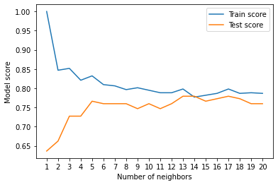
    


## 5.2.2 Tuning models with with RandomizedSearchCV & GridSearchCV
Now let's use `RandomizedSearchCV` to try and tune our `LogisticRegression` model.

We'll pass it the different hyperparameters from `log_reg_grid` as well as set `n_iter = 20`. This means, `RandomizedSearchCV` will try 20 different combinations of hyperparameters from `log_reg_grid` and save the best ones.


```python
# Different LogisticRegression hyperparameters
log_reg_grid = [{'penalty' : ['l1', 'l2', 'elasticnet', 'none'],
                'C' : np.logspace(-4, 4, 20),
                'solver' : ['newton-cg', 'lbfgs', 'liblinear', 'sag', 'saga'],
                'max_iter' : [100, 1000,2500, 5000]
                }]

# Different RandomForestClassifier hyperparameters
# RF_grid = {'n_estimators': [10, 17, 25, 33, 41, 48, 56, 64, 72, 80], 
#            'max_features': ['auto', 'sqrt'], 
#            'max_depth': [2, 4,8, 12, 16], 
#            'min_samples_split': [2, 5], 
#            'min_samples_leaf': [1, 2], 
#            'bootstrap': [True, False]
#           }
# RF_grid = {'bootstrap': [True, False],
#            'max_depth': [10, 20, 30, 40, 50, 60, 70, 80, 90, 100, None],
#            'max_features': ['auto', 'sqrt'],
#            'min_samples_leaf': [1, 2, 4],
#             'min_samples_split': [2, 5, 10],
#              'n_estimators': [200, 400, 600, 800, 1000, 1200, 1400, 1600, 1800, 2000]}
#Different RandomForestClassifier hyperparameters
RF_grid = {'n_estimators': [ 56], 
           'max_features': ['sqrt'], 
           'max_depth': [4] ,
           'min_samples_split': [5], 
           'min_samples_leaf': [1], 
           'bootstrap': [True]
          }
         


# Different Naïve Bayes hyperparameters
NB_grid = { 'var_smoothing': [1e-2, 1e-3, 1e-4, 1e-5, 1e-6, 1e-7, 1e-8, 1e-9, 1e-10, 
                              1e-11, 1e-12, 1e-13, 1e-14, 1e-15]}


DT_grid ={'splitter' : ['best', 'random'],
            'criterion' : ['gini', 'entropy'],
            'max_features': ['log2', 'sqrt','auto'],
            'max_depth': [2, 3, 5, 10, 17],
            'min_samples_split': [2, 3, 5, 7, 9],
            'min_samples_leaf': [1,5,8,11],
            'random_state' : [0,1,2,3,4,5]
}


# Different SMV hyperparameters
SVM_grid = [{'C': [1, 10, 100, 1000], 'kernel': ['linear']},
            {'C': [1, 10, 100, 1000], 'kernel': ['rbf'], 'gamma': [0.1, 0.2, 0.3, 0.4, 0.5, 0.6, 0.7, 0.8, 0.9]}
           ]
            
```


```python
# Setup grid hyperparameter search for SVM
gs_svm = GridSearchCV(SVC(),
                          param_grid=SVM_grid,
                          cv=10,
                           scoring='accuracy',
                          n_jobs=-1)

# Fit grid hyperparameter search model
gs_svm.fit(X_train, y_train)
```


    GridSearchCV(cv=10, estimator=SVC(), n_jobs=-1,
                 param_grid=[{'C': [1, 10, 100, 1000], 'kernel': ['linear']},
                             {'C': [1, 10, 100, 1000],
                              'gamma': [0.1, 0.2, 0.3, 0.4, 0.5, 0.6, 0.7, 0.8,
                                        0.9],
                              'kernel': ['rbf']}],
                 scoring='accuracy')


```python
# Check the best parameters
gs_svm.best_params_
```


    {'C': 1, 'kernel': 'linear'}


```python
# Evaluate the model
gs_svm.score(X_test, y_test)
```


    0.7597402597402597


```python
# # Setup grid hyperparameter search for LogisticRegression
# gs_log_reg = GridSearchCV(LogisticRegression(),
#                           param_grid=log_reg_grid,
#                           cv=10,
#                            scoring='accuracy',
#                           n_jobs=-1)

# # Fit grid hyperparameter search model
# gs_log_reg.fit(X_train, y_train)
```


```python
# Check the best parameters
gs_log_reg.best_params_
```


    {'C': 0.08858667904100823, 'max_iter': 100, 'penalty': 'l1', 'solver': 'saga'}


```python
# Evaluate the model
gs_log_reg.score(X_test, y_test) 
```


    0.7792207792207793


```python
# Setup grid hyperparameter search for Random forest
gs_rf = GridSearchCV(RandomForestClassifier(),
                          param_grid=RF_grid,
                          cv=10,
                           scoring='accuracy',
                          n_jobs=-1)

# Fit grid hyperparameter search model
gs_rf.fit(X_train, y_train)
```


    GridSearchCV(cv=10, estimator=RandomForestClassifier(), n_jobs=-1,
                 param_grid={'bootstrap': [True], 'max_depth': [4],
                             'max_features': ['sqrt'], 'min_samples_leaf': [1],
                             'min_samples_split': [5], 'n_estimators': [56]},
                 scoring='accuracy')


```python
# Check the best parameters
gs_rf.best_params_
```


    {'bootstrap': True,
     'max_depth': 4,
     'max_features': 'sqrt',
     'min_samples_leaf': 1,
     'min_samples_split': 5,
     'n_estimators': 56}


```python
# Evaluate the model
gs_rf.score(X_test, y_test)
```


    0.7857142857142857


```python
# Setup grid hyperparameter search for NB
gs_nb = GridSearchCV(GaussianNB(),
                          param_grid=NB_grid,
                          cv=10,
                           scoring='accuracy',
                          n_jobs=-1)

# Fit grid hyperparameter search model
gs_nb.fit(X_train, y_train)
```


    GridSearchCV(cv=10, estimator=GaussianNB(), n_jobs=-1,
                 param_grid={'var_smoothing': [0.01, 0.001, 0.0001, 1e-05, 1e-06,
                                               1e-07, 1e-08, 1e-09, 1e-10, 1e-11,
                                               1e-12, 1e-13, 1e-14, 1e-15]},
                 scoring='accuracy')


```python
# Check the best parameters
gs_nb.best_params_
```


    {'var_smoothing': 0.01}


```python
# Evaluate the model
gs_nb.score(X_test, y_test)
```


    0.7532467532467533


```python
# Setup grid hyperparameter search for Decision Tree
gs_dt = GridSearchCV( DecisionTreeClassifier(),
                          param_grid=DT_grid,
                          cv=10,
                           scoring='accuracy',
                          n_jobs=-1)

# Fit grid hyperparameter search model
gs_dt.fit(X_train, y_train)
```


    GridSearchCV(cv=10, estimator=DecisionTreeClassifier(), n_jobs=-1,
                 param_grid={'criterion': ['gini', 'entropy'],
                             'max_depth': [2, 3, 5, 10, 17],
                             'max_features': ['log2', 'sqrt', 'auto'],
                             'min_samples_leaf': [1, 5, 8, 11],
                             'min_samples_split': [2, 3, 5, 7, 9],
                             'random_state': [0, 1, 2, 3, 4, 5],
                             'splitter': ['best', 'random']},
                 scoring='accuracy')


```python
# Check the best parameters
gs_dt.best_params_
```


    {'criterion': 'entropy',
     'max_depth': 5,
     'max_features': 'log2',
     'min_samples_leaf': 1,
     'min_samples_split': 7,
     'random_state': 4,
     'splitter': 'random'}


```python
# Evaluate the model
gs_dt.score(X_test, y_test)
```


    0.7467532467532467


### 5.2.2.1 Model Comparison after Hyperparameter Tuning


```python
Tuned_Accuracy = {
          "KNN": max(test_scores)*100,
          "Logistic Regression": gs_log_reg.score(X_test, y_test)*100, 
          "Random Forest": gs_rf.score(X_test, y_test)*100,
          "Decision Tree": gs_dt.score(X_test, y_test)*100,
          "SVM": gs_svm.score(X_test, y_test)*100,
          "Naive Bayes":gs_nb.score(X_test, y_test)*100}
```


```python
model_tuned = pd.DataFrame(Tuned_Accuracy, index=['Tuned-accuracy'])
model_tuned.T.plot.bar();
```


    
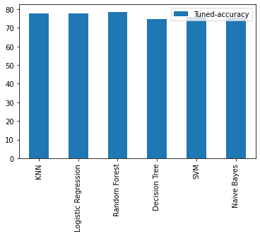
    


```python
model_tuned
```


<div>
<style scoped>
    .dataframe tbody tr th:only-of-type {
        vertical-align: middle;
    }

    .dataframe tbody tr th {
        vertical-align: top;
    }

    .dataframe thead th {
        text-align: right;
    }
</style>
<table border="1" class="dataframe">
  <thead>
    <tr style="text-align: right;">
      <th></th>
      <th>KNN</th>
      <th>Logistic Regression</th>
      <th>Random Forest</th>
      <th>Decision Tree</th>
      <th>SVM</th>
      <th>Naive Bayes</th>
    </tr>
  </thead>
  <tbody>
    <tr>
      <th>Tuned-accuracy</th>
      <td>77.922078</td>
      <td>77.922078</td>
      <td>78.571429</td>
      <td>74.675325</td>
      <td>75.974026</td>
      <td>75.324675</td>
    </tr>
  </tbody>
</table>
</div>


## 5.3 Evaluating a classification model, beyond accuracy

### 5.3.1 Confusion Matrix


```python
# making predictions on test dataset after Tuning our models 

#Logistic Regression
lr_pred=gs_log_reg.predict(X_test)

# K-Nearest Neighbors (KNN)
knn_pred=gs_knn.predict(X_test)

#Naíve Bayes
nb_pred=gs_nb.predict(X_test)

# Support Vector Machine (SVM)
svm_pred=gs_svm.predict(X_test)

# Random Forest 
rf_pred=gs_rf.predict(X_test)

# Decison Tree
dt_pred=gs_dt.predict(X_test)
```

### 5.3.1.1 Confusion Matrix for Logistic regression


```python
#Logistic Regression
cm_lr=confusion_matrix(y_test, lr_pred)
cm_lr
```


    array([[86, 13],
           [21, 34]])


```python
# Making the confusion Matrix of Logistic Regression
cm_lr=confusion_matrix(y_test, lr_pred)

print("TN - True Negative {}".format(cm_lr[0, 0]))
print("FP - False Positive {}".format(cm_lr[0, 1]))
print("FN - False Negative {}".format(cm_lr[1, 0]))
print("TP - True Positive {}".format(cm_lr[1, 1]))

print("Accuracy Rate: {}".format(np.divide(np.sum([cm_lr[0, 0], cm_lr[1, 1]]), np.sum(cm_lr))*100))
print("MissClassification Rate: {}".format(np.divide(np.sum([cm_lr[0, 1], cm_lr[1, 0]]), np.sum(cm_lr))*100))
```

    TN - True Negative 86
    FP - False Positive 13
    FN - False Negative 21
    TP - True Positive 34
    Accuracy Rate: 77.92207792207793
    MissClassification Rate: 22.07792207792208


```python
plt.clf()
plt.imshow(cm_lr, interpolation='nearest', cmap=plt.cm.Wistia)
classNames = ['0', '1']
plt.title = ("Confusion Matrix of Logistic regression")
plt.ylabel('Actual(true) values')
plt.xlabel('Predicted values')
tick_marks = np.arange(len(classNames))
plt.xticks(tick_marks, classNames, rotation=45)
plt.yticks(tick_marks, classNames)
s = [['TN', 'FP'], ['FN', 'TP']]
for i in range(2):
    for j in range(2):
        plt.text(j,i,str(s[i][j])+" = "+ str(cm[i][j]))
        
plt.show()
```


    

    


```python
lr_cm=pd.crosstab(y_test, lr_pred, rownames=['Actual Values'], colnames=['Predicted values'], margins=True)
lr_cm
```


<div>
<style scoped>
    .dataframe tbody tr th:only-of-type {
        vertical-align: middle;
    }

    .dataframe tbody tr th {
        vertical-align: top;
    }

    .dataframe thead th {
        text-align: right;
    }
</style>
<table border="1" class="dataframe">
  <thead>
    <tr style="text-align: right;">
      <th>Predicted values</th>
      <th>0</th>
      <th>1</th>
      <th>All</th>
    </tr>
    <tr>
      <th>Actual Values</th>
      <th></th>
      <th></th>
      <th></th>
    </tr>
  </thead>
  <tbody>
    <tr>
      <th>0</th>
      <td>86</td>
      <td>13</td>
      <td>99</td>
    </tr>
    <tr>
      <th>1</th>
      <td>21</td>
      <td>34</td>
      <td>55</td>
    </tr>
    <tr>
      <th>All</th>
      <td>107</td>
      <td>47</td>
      <td>154</td>
    </tr>
  </tbody>
</table>
</div>


### 5.3.1.2 Confusion Matrix for KNN


```python
#KNN
cm_knn=confusion_matrix(y_test, knn_pred)
cm_knn
```


    array([[86, 13],
           [21, 34]])


```python
# Making the confusion Matrix of KNN
cm_knn=confusion_matrix(y_test, knn_pred)

print("TN - True Negative {}".format(cm_knn[0, 0]))
print("FP - False Positive {}".format(cm_knn[0, 1]))
print("FN - False Negative {}".format(cm_knn[1, 0]))
print("TP - True Positive {}".format(cm_knn[1, 1]))

print("Accuracy Rate: {}".format(np.divide(np.sum([cm_knn[0, 0], cm_knn[1, 1]]), np.sum(cm_knn))*100))
print("MissClassification Rate: {}".format(np.divide(np.sum([cm_knn[0, 1], cm_knn[1, 0]]), np.sum(cm_knn))*100))
```

    TN - True Negative 86
    FP - False Positive 13
    FN - False Negative 21
    TP - True Positive 34
    Accuracy Rate: 77.92207792207793
    MissClassification Rate: 22.07792207792208


```python
cm=cm_knn
plt.clf()
plt.imshow(cm, interpolation='nearest', cmap=plt.cm.Wistia)
classNames = ['0', '1']
plt.title = ("Confusion Matrix of Logistic regression")
plt.ylabel('Actual(true) values')
plt.xlabel('Predicted values')
tick_marks = np.arange(len(classNames))
plt.xticks(tick_marks, classNames, rotation=45)
plt.yticks(tick_marks, classNames)
s = [['TN', 'FP'], ['FN', 'TP']]
for i in range(2):
    for j in range(2):
        plt.text(j,i,str(s[i][j])+" = "+ str(cm[i][j]))
        
plt.show()
```


    
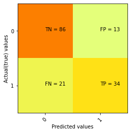
    


```python
knn_cm = pd.crosstab(y_test, knn_pred, rownames=['Actual Values'], colnames=['Predicted values'], margins=True)
knn_cm
```


<div>
<style scoped>
    .dataframe tbody tr th:only-of-type {
        vertical-align: middle;
    }

    .dataframe tbody tr th {
        vertical-align: top;
    }

    .dataframe thead th {
        text-align: right;
    }
</style>
<table border="1" class="dataframe">
  <thead>
    <tr style="text-align: right;">
      <th>Predicted values</th>
      <th>0</th>
      <th>1</th>
      <th>All</th>
    </tr>
    <tr>
      <th>Actual Values</th>
      <th></th>
      <th></th>
      <th></th>
    </tr>
  </thead>
  <tbody>
    <tr>
      <th>0</th>
      <td>86</td>
      <td>13</td>
      <td>99</td>
    </tr>
    <tr>
      <th>1</th>
      <td>21</td>
      <td>34</td>
      <td>55</td>
    </tr>
    <tr>
      <th>All</th>
      <td>107</td>
      <td>47</td>
      <td>154</td>
    </tr>
  </tbody>
</table>
</div>


### 5.3.1.3 Confusion Matrix for Naïve bayes


```python
#NB
cm_nb=confusion_matrix(y_test, nb_pred)
cm_nb
```


    array([[78, 21],
           [17, 38]])


```python
TN = cm_nb[0, 0]
FP = cm_nb[0, 1]
FN = cm_nb[1, 0]
TP = cm_nb[1, 1]
TN, FP, FN, TP
```


    (78, 21, 17, 38)


```python
# Making the confusion Matrix of NB
cm_nb=confusion_matrix(y_test, nb_pred)

print("TN - True Negative {}".format(cm_nb[0, 0]))
print("FP - False Positive {}".format(cm_nb[0, 1]))
print("FN - False Negative {}".format(cm_nb[1, 0]))
print("TP - True Positive {}".format(cm_nb[1, 1]))

print("Accuracy Rate: {}".format(np.divide(np.sum([cm_nb[0, 0], cm_nb[1, 1]]), np.sum(cm_nb))*100))
print("MissClassification Rate: {}".format(np.divide(np.sum([cm_nb[0, 1], cm_nb[1, 0]]), np.sum(cm_nb))*100))
```

    TN - True Negative 78
    FP - False Positive 21
    FN - False Negative 17
    TP - True Positive 38
    Accuracy Rate: 75.32467532467533
    MissClassification Rate: 24.675324675324674


```python
75.32467532467533 + 24.675324675324674
```


    100.0


```python
cm=cm_nb
plt.clf()
plt.imshow(cm, interpolation='nearest', cmap=plt.cm.Wistia)
classNames = ['0', '1']
plt.title = ("Confusion Matrix of Logistic regression")
plt.ylabel('Actual(true) values')
plt.xlabel('Predicted values')
tick_marks = np.arange(len(classNames))
plt.xticks(tick_marks, classNames, rotation=45)
plt.yticks(tick_marks, classNames)
s = [['TN', 'FP'], ['FN', 'TP']]
for i in range(2):
    for j in range(2):
        plt.text(j,i,str(s[i][j])+" = "+ str(cm[i][j]))
        
plt.show()
```


    
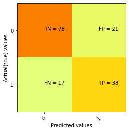
    


```python
nb_cm=pd.crosstab(y_test, nb_pred, rownames=['Actual Values'], colnames=['Predicted values'], margins=True)
nb_cm
```


<div>
<style scoped>
    .dataframe tbody tr th:only-of-type {
        vertical-align: middle;
    }

    .dataframe tbody tr th {
        vertical-align: top;
    }

    .dataframe thead th {
        text-align: right;
    }
</style>
<table border="1" class="dataframe">
  <thead>
    <tr style="text-align: right;">
      <th>Predicted values</th>
      <th>0</th>
      <th>1</th>
      <th>All</th>
    </tr>
    <tr>
      <th>Actual Values</th>
      <th></th>
      <th></th>
      <th></th>
    </tr>
  </thead>
  <tbody>
    <tr>
      <th>0</th>
      <td>78</td>
      <td>21</td>
      <td>99</td>
    </tr>
    <tr>
      <th>1</th>
      <td>17</td>
      <td>38</td>
      <td>55</td>
    </tr>
    <tr>
      <th>All</th>
      <td>95</td>
      <td>59</td>
      <td>154</td>
    </tr>
  </tbody>
</table>
</div>


### 5.3.1.4 Confusion Matrix for SVM


```python
#SVM
cm_svm=confusion_matrix(y_test, svm_pred)
cm_svm
```


    array([[82, 17],
           [20, 35]])


```python
# Making the confusion Matrix of SVM
cm_svm=confusion_matrix(y_test, svm_pred)

print("TN - True Negative {}".format(cm_svm[0, 0]))
print("FP - False Positive {}".format(cm_svm[0, 1]))
print("FN - False Negative {}".format(cm_svm[1, 0]))
print("TP - True Positive {}".format(cm_svm[1, 1]))

print("Accuracy Rate: {}".format(np.divide(np.sum([cm_svm[0, 0], cm_svm[1, 1]]), np.sum(cm_svm))*100))
print("MissClassification Rate: {}".format(np.divide(np.sum([cm_svm[0, 1], cm_svm[1, 0]]), np.sum(cm_svm))*100))
```

    TN - True Negative 82
    FP - False Positive 17
    FN - False Negative 20
    TP - True Positive 35
    Accuracy Rate: 75.97402597402598
    MissClassification Rate: 24.025974025974026


```python
cm=cm_svm
plt.clf()
plt.imshow(cm, interpolation='nearest', cmap=plt.cm.Wistia)
classNames = ['0', '1']
plt.title = ("Confusion Matrix of Logistic regression")
plt.ylabel('Actual(true) values')
plt.xlabel('Predicted values')
tick_marks = np.arange(len(classNames))
plt.xticks(tick_marks, classNames, rotation=45)
plt.yticks(tick_marks, classNames)
s = [['TN', 'FP'], ['FN', 'TP']]
for i in range(2):
    for j in range(2):
        plt.text(j,i,str(s[i][j])+" = "+ str(cm[i][j]))
        
plt.show()
```


    
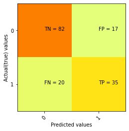
    


```python
svm_cm=pd.crosstab(y_test, nb_pred, rownames=['Actual Values'], colnames=['Predicted values'], margins=True)
svm_cm
```


<div>
<style scoped>
    .dataframe tbody tr th:only-of-type {
        vertical-align: middle;
    }

    .dataframe tbody tr th {
        vertical-align: top;
    }

    .dataframe thead th {
        text-align: right;
    }
</style>
<table border="1" class="dataframe">
  <thead>
    <tr style="text-align: right;">
      <th>Predicted values</th>
      <th>0</th>
      <th>1</th>
      <th>All</th>
    </tr>
    <tr>
      <th>Actual Values</th>
      <th></th>
      <th></th>
      <th></th>
    </tr>
  </thead>
  <tbody>
    <tr>
      <th>0</th>
      <td>78</td>
      <td>21</td>
      <td>99</td>
    </tr>
    <tr>
      <th>1</th>
      <td>17</td>
      <td>38</td>
      <td>55</td>
    </tr>
    <tr>
      <th>All</th>
      <td>95</td>
      <td>59</td>
      <td>154</td>
    </tr>
  </tbody>
</table>
</div>


### 5.3.1.5 Confusion Matrix for Random Forest


```python
#RF
cm_rf=confusion_matrix(y_test, rf_pred)
cm_rf
```


    array([[87, 12],
           [21, 34]])


```python
# Making the confusion Matrix of NB
cm_rf=confusion_matrix(y_test, rf_pred)

print("TN - True Negative {}".format(cm_rf[0, 0]))
print("FP - False Positive {}".format(cm_rf[0, 1]))
print("FN - False Negative {}".format(cm_rf[1, 0]))
print("TP - True Positive {}".format(cm_rf[1, 1]))

print("Accuracy Rate: {}".format(np.divide(np.sum([cm_rf[0, 0], cm_rf[1, 1]]), np.sum(cm_rf))*100))
print("MissClassification Rate: {}".format(np.divide(np.sum([cm_rf[0, 1], cm_rf[1, 0]]), np.sum(cm_rf))*100))
```

    TN - True Negative 87
    FP - False Positive 12
    FN - False Negative 21
    TP - True Positive 34
    Accuracy Rate: 78.57142857142857
    MissClassification Rate: 21.428571428571427


```python
cm=cm_rf
plt.clf()
plt.imshow(cm, interpolation='nearest', cmap=plt.cm.Wistia)
classNames = ['0', '1']
plt.title = ("Confusion Matrix of Logistic regression")
plt.ylabel('Actual(true) values')
plt.xlabel('Predicted values')
tick_marks = np.arange(len(classNames))
plt.xticks(tick_marks, classNames, rotation=45)
plt.yticks(tick_marks, classNames)
s = [['TN', 'FP'], ['FN', 'TP']]
for i in range(2):
    for j in range(2):
        plt.text(j,i,str(s[i][j])+" = "+ str(cm[i][j]))
        
plt.show()
```


    

    


```python
rf_cm=pd.crosstab(y_test, rf_pred, rownames=['Actual Values'], colnames=['Predicted values'], margins=True)
rf_cm
```


<div>
<style scoped>
    .dataframe tbody tr th:only-of-type {
        vertical-align: middle;
    }

    .dataframe tbody tr th {
        vertical-align: top;
    }

    .dataframe thead th {
        text-align: right;
    }
</style>
<table border="1" class="dataframe">
  <thead>
    <tr style="text-align: right;">
      <th>Predicted values</th>
      <th>0</th>
      <th>1</th>
      <th>All</th>
    </tr>
    <tr>
      <th>Actual Values</th>
      <th></th>
      <th></th>
      <th></th>
    </tr>
  </thead>
  <tbody>
    <tr>
      <th>0</th>
      <td>87</td>
      <td>12</td>
      <td>99</td>
    </tr>
    <tr>
      <th>1</th>
      <td>21</td>
      <td>34</td>
      <td>55</td>
    </tr>
    <tr>
      <th>All</th>
      <td>108</td>
      <td>46</td>
      <td>154</td>
    </tr>
  </tbody>
</table>
</div>


### 5.3.1.5 Confusion Matrix for Decison Tree


```python
#DT
cm_dt=confusion_matrix(y_test, dt_pred)
cm_dt
```


    array([[87, 12],
           [27, 28]])


```python
# Making the confusion Matrix of NB
cm_dt=confusion_matrix(y_test, dt_pred)

print("TN - True Negative {}".format(cm_dt[0, 0]))
print("FP - False Positive {}".format(cm_dt[0, 1]))
print("FN - False Negative {}".format(cm_dt[1, 0]))
print("TP - True Positive {}".format(cm_dt[1, 1]))

print("Accuracy Rate: {}".format(np.divide(np.sum([cm_dt[0, 0], cm_dt[1, 1]]), np.sum(cm_dt))*100))
print("MissClassification Rate: {}".format(np.divide(np.sum([cm_dt[0, 1], cm_dt[1, 0]]), np.sum(cm_dt))*100))
```

    TN - True Negative 87
    FP - False Positive 12
    FN - False Negative 27
    TP - True Positive 28
    Accuracy Rate: 74.67532467532467
    MissClassification Rate: 25.324675324675322


```python
cm=cm_dt
plt.clf()
plt.imshow(cm, interpolation='nearest', cmap=plt.cm.Wistia)
classNames = ['0', '1']
plt.title =("Confusion Matrix of Logistic regression")
plt.ylabel('Actual(true) values')
plt.xlabel('Predicted values')
tick_marks = np.arange(len(classNames))
plt.xticks(tick_marks, classNames, rotation=45)
plt.yticks(tick_marks, classNames)
s = [['TN', 'FP'], ['FN', 'TP']]
for i in range(2):
    for j in range(2):
        plt.text(j,i,str(s[i][j])+" = "+ str(cm[i][j]))
        
plt.show()
```


    
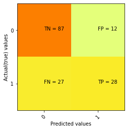
    


```python
dt_cm=pd.crosstab(y_test, dt_pred, rownames=['Actual Values'], colnames=['Predicted values'], margins=True)
dt_cm
```


<div>
<style scoped>
    .dataframe tbody tr th:only-of-type {
        vertical-align: middle;
    }

    .dataframe tbody tr th {
        vertical-align: top;
    }

    .dataframe thead th {
        text-align: right;
    }
</style>
<table border="1" class="dataframe">
  <thead>
    <tr style="text-align: right;">
      <th>Predicted values</th>
      <th>0</th>
      <th>1</th>
      <th>All</th>
    </tr>
    <tr>
      <th>Actual Values</th>
      <th></th>
      <th></th>
      <th></th>
    </tr>
  </thead>
  <tbody>
    <tr>
      <th>0</th>
      <td>87</td>
      <td>12</td>
      <td>99</td>
    </tr>
    <tr>
      <th>1</th>
      <td>27</td>
      <td>28</td>
      <td>55</td>
    </tr>
    <tr>
      <th>All</th>
      <td>114</td>
      <td>40</td>
      <td>154</td>
    </tr>
  </tbody>
</table>
</div>


### comparing all Confusion matrixes


```python
# models_cm = {
#           "Logestic Regression": lr_cm,
#           "K-Nearest Neighbors":knn_cm, 
#           "Naïve Bayes": nb_cm,
#           "Support Vector Machine": svm_cm,
#           "Random Forest": rf_cm,
#           "Decision Tree":dt_cm}
# classifiers = {
#           "KNN": gs_knn,
#           "Logistic Regression": gs_log_reg, 
#           "Random Forest": gs_rf,
#           "Decision Tree": gs_dt,
#           "SVM": gs_svm,
#           "Naive Bayes":gs_nb}
```

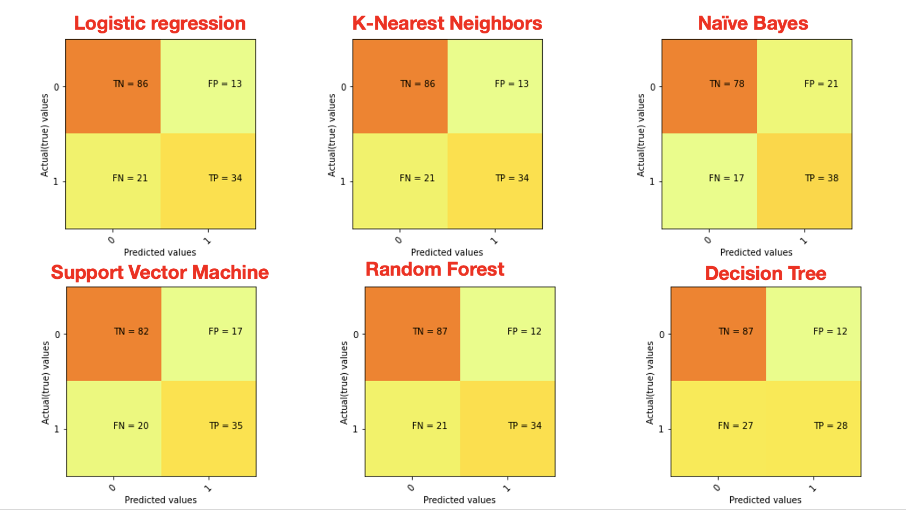

## 5.3.2 Classification Report

### 5.3.2.1 Logistic Regression


```python
TN =cm_lr[0, 0]
FP =cm_lr[0, 1]
FN =cm_lr[1, 0]
TP =cm_lr[1, 1]
TN, FP, FN, TP
```


    (86, 13, 21, 34)


### Precision (PPV - Positive Prediction Value)

### Precision = TP/(TP+FP)


```python
Precision = TP/(TP+FP)
Precision
```


    0.723404255319149


```python
print("Precision Score is: ", precision_score(y_test, lr_pred)*100)
print("Micro Average Precision Score is: ", precision_score(y_test, lr_pred, average='micro')*100)
print("Macro Average Precision Score is: ", precision_score(y_test, lr_pred, average='macro')*100)
print("Weighted Average Precision Score is: ", precision_score(y_test, lr_pred, average='weighted')*100)
print("Precision Score on non weighted score is: ", precision_score(y_test, lr_pred, average=None)*100)
```

    Precision Score is:  72.3404255319149
    Micro Average Precision Score is:  77.92207792207793
    Macro Average Precision Score is:  76.35712865380792
    Weighted Average Precision Score is:  77.50475811720592
    Precision Score on non weighted score is:  [80.37383178 72.34042553]


### Recall (TPR - True Positive Rate)

### Recall = TP/(TP+FN)


```python
Recall = TP/(TP+FN)
Recall
```


    0.6181818181818182


```python
print("Recall or Sensitively_score is: ", recall_score(y_test, lr_pred)*100)
print("Micro Average Recall Score is: ", recall_score(y_test, lr_pred, average='micro')*100)
print("Macro Average Recall Score is: ", recall_score(y_test, lr_pred, average='macro')*100)
print("Weighted Average Recall Score is: ", recall_score(y_test, lr_pred, average='weighted')*100)
print("Recall Score on non weighted score is: ", recall_score(y_test, lr_pred, average=None)*100)
```

    Recall or Sensitively_score is:  61.81818181818181
    Micro Average Recall Score is:  77.92207792207793
    Macro Average Recall Score is:  74.34343434343434
    Weighted Average Recall Score is:  77.92207792207793
    Recall Score on non weighted score is:  [86.86868687 61.81818182]


### False positive Rate (FPR)
### FPR = FP/(FP+TN)


```python
FPR = FP/ float(FP+TN)*100
print("False positive Rate: {0:0.4f}".format(FPR))
```

    False positive Rate: 13.1313


### Specificity
### Specificity = TN/(TN+FP)


```python
Specificity = TN/ float(TN+FP)*100
print("Specificity: {0:0.4f}".format(Specificity))
```

    Specificity: 86.8687


```python
print("f1_score of macro is: ", f1_score(y_test, lr_pred)*100)
print("Micro Average F1-Score is: ", f1_score(y_test, lr_pred, average='micro')*100)
print("Macro Average F1-Score is: ", f1_score(y_test, lr_pred, average='macro')*100)
print("Weighted Average F1-Score is: ", f1_score(y_test, lr_pred, average='weighted')*100)
print("F1-Score on non weighted score is: ", f1_score(y_test, lr_pred, average=None)*100)
```

    f1_score of macro is:  66.66666666666667
    Micro Average F1-Score is:  77.92207792207793
    Macro Average F1-Score is:  75.08090614886731
    Weighted Average F1-Score is:  77.48497457235321
    F1-Score on non weighted score is:  [83.49514563 66.66666667]


```python
print("Classification Report of Logistic Regration is: \n", classification_report(y_test, lr_pred, digits=4))
```

    Classification Report of Logistic Regration is: 
                   precision    recall  f1-score   support
    
               0     0.8037    0.8687    0.8350        99
               1     0.7234    0.6182    0.6667        55
    
        accuracy                         0.7792       154
       macro avg     0.7636    0.7434    0.7508       154
    weighted avg     0.7750    0.7792    0.7748       154
    


### 5.3.2.2 K-Nearest Neighbors


```python
TN =cm_knn[0, 0]
FP =cm_knn[0, 1]
FN =cm_knn[1, 0]
TP =cm_knn[1, 1]
TN, FP, FN, TP
```


    (86, 13, 21, 34)


```python
Precision = TP/(TP+FP)
Precision
```


    0.723404255319149


```python
print("Precision Score is: ", precision_score(y_test, knn_pred)*100)
print("Micro Average Precision Score is: ", precision_score(y_test, knn_pred, average='micro')*100)
print("Macro Average Precision Score is: ", precision_score(y_test, knn_pred, average='macro')*100)
print("Weighted Average Precision Score is: ", precision_score(y_test, knn_pred, average='weighted')*100)
print("Precision Score on non weighted score is: ", precision_score(y_test, knn_pred, average=None)*100)
```

    Precision Score is:  72.3404255319149
    Micro Average Precision Score is:  77.92207792207793
    Macro Average Precision Score is:  76.35712865380792
    Weighted Average Precision Score is:  77.50475811720592
    Precision Score on non weighted score is:  [80.37383178 72.34042553]


```python
Recall = TP/(TP+FN)
Recall
```


    0.6181818181818182


```python
print("Recall or Sensitively_score is: ", recall_score(y_test, knn_pred)*100)
print("Micro Average Recall Score is: ", recall_score(y_test, knn_pred, average='micro')*100)
print("Macro Average Recall Score is: ", recall_score(y_test, knn_pred, average='macro')*100)
print("Weighted Average Recall Score is: ", recall_score(y_test, knn_pred, average='weighted')*100)
print("Recall Score on non weighted score is: ", recall_score(y_test, knn_pred, average=None)*100)
```

    Recall or Sensitively_score is:  61.81818181818181
    Micro Average Recall Score is:  77.92207792207793
    Macro Average Recall Score is:  74.34343434343434
    Weighted Average Recall Score is:  77.92207792207793
    Recall Score on non weighted score is:  [86.86868687 61.81818182]


```python
FPR = FP/ float(FP+TN)*100
print("False positive Rate: {0:0.4f}".format(FPR))
```

    False positive Rate: 13.1313


```python
Specificity = TN/ float(TN+FP)*100
print("Specificity: {0:0.4f}".format(Specificity))
```

    Specificity: 86.8687


```python
print("f1_score of macro is: ", f1_score(y_test, knn_pred)*100)
print("Micro Average F1-Score is: ", f1_score(y_test, knn_pred, average='micro')*100)
print("Macro Average F1-Score is: ", f1_score(y_test, knn_pred, average='macro')*100)
print("Weighted Average F1-Score is: ", f1_score(y_test, knn_pred, average='weighted')*100)
print("F1-Score on non weighted score is: ", f1_score(y_test, knn_pred, average=None)*100)
```

    f1_score of macro is:  66.66666666666667
    Micro Average F1-Score is:  77.92207792207793
    Macro Average F1-Score is:  75.08090614886731
    Weighted Average F1-Score is:  77.48497457235321
    F1-Score on non weighted score is:  [83.49514563 66.66666667]


```python
print("Classification Report of KNN is: \n", classification_report(y_test, knn_pred, digits=4))
```

    Classification Report of KNN is: 
                   precision    recall  f1-score   support
    
               0     0.8037    0.8687    0.8350        99
               1     0.7234    0.6182    0.6667        55
    
        accuracy                         0.7792       154
       macro avg     0.7636    0.7434    0.7508       154
    weighted avg     0.7750    0.7792    0.7748       154
    


### 5.3.2.3 Naïve Bayes


```python
TN =cm_nb[0, 0]
FP =cm_nb[0, 1]
FN =cm_nb[1, 0]
TP =cm_nb[1, 1]
TN, FP, FN, TP
```


    (78, 21, 17, 38)


```python
Precision = TP/(TP+FP)
Precision
```


    0.6440677966101694


```python
print("Precision Score is: ", precision_score(y_test, nb_pred)*100)
print("Micro Average Precision Score is: ", precision_score(y_test, nb_pred, average='micro')*100)
print("Macro Average Precision Score is: ", precision_score(y_test, nb_pred, average='macro')*100)
print("Weighted Average Precision Score is: ", precision_score(y_test, nb_pred, average='weighted')*100)
print("Precision Score on non weighted score is: ", precision_score(y_test, nb_pred, average=None)*100)
```

    Precision Score is:  64.40677966101694
    Micro Average Precision Score is:  75.32467532467533
    Macro Average Precision Score is:  73.25602140945584
    Weighted Average Precision Score is:  75.7843761947241
    Precision Score on non weighted score is:  [82.10526316 64.40677966]


```python
Recall = TP/(TP+FN)
Recall
```


    0.6909090909090909


```python
print("Recall or Sensitively_score is: ", recall_score(y_test, nb_pred)*100)
print("Micro Average Recall Score is: ", recall_score(y_test, nb_pred, average='micro')*100)
print("Macro Average Recall Score is: ", recall_score(y_test, nb_pred, average='macro')*100)
print("Weighted Average Recall Score is: ", recall_score(y_test, nb_pred, average='weighted')*100)
print("Recall Score on non weighted score is: ", recall_score(y_test, nb_pred, average=None)*100)
```

    Recall or Sensitively_score is:  69.0909090909091
    Micro Average Recall Score is:  75.32467532467533
    Macro Average Recall Score is:  73.93939393939394
    Weighted Average Recall Score is:  75.32467532467533
    Recall Score on non weighted score is:  [78.78787879 69.09090909]


```python
FPR = FP/ float(FP+TN)*100
print("False positive Rate: {0:0.4f}".format(FPR))
```

    False positive Rate: 21.2121


```python
Specificity = TN/ float(TN+FP)*100
print("Specificity: {0:0.4f}".format(Specificity))
```

    Specificity: 78.7879


```python
print("f1_score of macro is: ", f1_score(y_test, nb_pred)*100)
print("Micro Average F1-Score is: ", f1_score(y_test, nb_pred, average='micro')*100)
print("Macro Average F1-Score is: ", f1_score(y_test, nb_pred, average='macro')*100)
print("Weighted Average F1-Score is: ", f1_score(y_test, nb_pred, average='weighted')*100)
print("F1-Score on non weighted score is: ", f1_score(y_test, nb_pred, average=None)*100)
```

    f1_score of macro is:  66.66666666666666
    Micro Average F1-Score is:  75.32467532467531
    Macro Average F1-Score is:  73.53951890034364
    Weighted Average F1-Score is:  75.5031909671085
    F1-Score on non weighted score is:  [80.41237113 66.66666667]


```python
print("Classification Report of Naïve Bayes is: \n", classification_report(y_test, nb_pred, digits=4))
```

    Classification Report of Naïve Bayes is: 
                   precision    recall  f1-score   support
    
               0     0.8211    0.7879    0.8041        99
               1     0.6441    0.6909    0.6667        55
    
        accuracy                         0.7532       154
       macro avg     0.7326    0.7394    0.7354       154
    weighted avg     0.7578    0.7532    0.7550       154
    


### 5.3.2.4 Support Vector Machine


```python
TN =cm_svm[0, 0]
FP =cm_svm[0, 1]
FN =cm_svm[1, 0]
TP =cm_svm[1, 1]
TN, FP, FN, TP
```


    (82, 17, 20, 35)


```python
Precision = TP/(TP+FP)
Precision
```


    0.6730769230769231


```python
print("Precision Score is: ", precision_score(y_test, svm_pred)*100)
print("Micro Average Precision Score is: ", precision_score(y_test, svm_pred, average='micro')*100)
print("Macro Average Precision Score is: ", precision_score(y_test, svm_pred, average='macro')*100)
print("Weighted Average Precision Score is: ", precision_score(y_test, svm_pred, average='weighted')*100)
print("Precision Score on non weighted score is: ", precision_score(y_test, svm_pred, average=None)*100)
```

    Precision Score is:  67.3076923076923
    Micro Average Precision Score is:  75.97402597402598
    Macro Average Precision Score is:  73.8499245852187
    Weighted Average Precision Score is:  75.7191338073691
    Precision Score on non weighted score is:  [80.39215686 67.30769231]


```python
Recall = TP/(TP+FN)
Recall
```


    0.6363636363636364


```python
print("Recall or Sensitively_score is: ", recall_score(y_test, svm_pred)*100)
print("Micro Average Recall Score is: ", recall_score(y_test, svm_pred, average='micro')*100)
print("Macro Average Recall Score is: ", recall_score(y_test,svm_pred, average='macro')*100)
print("Weighted Average Recall Score is: ", recall_score(y_test, svm_pred, average='weighted')*100)
print("Recall Score on non weighted score is: ", recall_score(y_test, svm_pred, average=None)*100)
```

    Recall or Sensitively_score is:  63.63636363636363
    Micro Average Recall Score is:  75.97402597402598
    Macro Average Recall Score is:  73.23232323232322
    Weighted Average Recall Score is:  75.97402597402598
    Recall Score on non weighted score is:  [82.82828283 63.63636364]


```python
FPR = FP/ float(FP+TN)*100
print("False positive Rate: {0:0.4f}".format(FPR))
```

    False positive Rate: 17.1717


```python
Specificity = TN/ float(TN+FP)*100
print("Specificity: {0:0.4f}".format(Specificity))
```

    Specificity: 82.8283


```python
print("f1_score of macro is: ", f1_score(y_test, svm_pred)*100)
print("Micro Average F1-Score is: ", f1_score(y_test, svm_pred, average='micro')*100)
print("Macro Average F1-Score is: ", f1_score(y_test, svm_pred, average='macro')*100)
print("Weighted Average F1-Score is: ", f1_score(y_test, svm_pred, average='weighted')*100)
print("F1-Score on non weighted score is: ", f1_score(y_test, svm_pred, average=None)*100)
```

    f1_score of macro is:  65.42056074766354
    Micro Average F1-Score is:  75.97402597402598
    Macro Average F1-Score is:  73.50630027432928
    Weighted Average F1-Score is:  75.81651156766236
    F1-Score on non weighted score is:  [81.5920398  65.42056075]


```python
print("Classification Report of Support Vector Machine is: \n", classification_report(y_test, svm_pred, digits=4))
```

    Classification Report of Support Vector Machine is: 
                   precision    recall  f1-score   support
    
               0     0.8039    0.8283    0.8159        99
               1     0.6731    0.6364    0.6542        55
    
        accuracy                         0.7597       154
       macro avg     0.7385    0.7323    0.7351       154
    weighted avg     0.7572    0.7597    0.7582       154
    


### 5.3.2.5 Random Forest


```python
TN =cm_rf[0, 0]
FP =cm_rf[0, 1]
FN =cm_rf[1, 0]
TP =cm_rf[1, 1]
TN, FP, FN, TP
```


    (87, 12, 21, 34)


```python
Precision = TP/(TP+FP)
Precision
```


    0.7391304347826086


```python
print("Precision Score is: ", precision_score(y_test, rf_pred)*100)
print("Micro Average Precision Score is: ", precision_score(y_test, rf_pred, average='micro')*100)
print("Macro Average Precision Score is: ", precision_score(y_test, rf_pred, average='macro')*100)
print("Weighted Average Precision Score is: ", precision_score(y_test, rf_pred, average='weighted')*100)
print("Precision Score on non weighted score is: ", precision_score(y_test, rf_pred, average=None)*100)
```

    Precision Score is:  73.91304347826086
    Micro Average Precision Score is:  78.57142857142857
    Macro Average Precision Score is:  77.23429951690821
    Weighted Average Precision Score is:  78.1832298136646
    Precision Score on non weighted score is:  [80.55555556 73.91304348]


```python
Recall = TP/(TP+FN)
Recall
```


    0.6181818181818182


```python
print("Recall or Sensitively_score is: ", recall_score(y_test, rf_pred)*100)
print("Micro Average Recall Score is: ", recall_score(y_test, rf_pred, average='micro')*100)
print("Macro Average Recall Score is: ", recall_score(y_test,rf_pred, average='macro')*100)
print("Weighted Average Recall Score is: ", recall_score(y_test, rf_pred, average='weighted')*100)
print("Recall Score on non weighted score is: ", recall_score(y_test, rf_pred, average=None)*100)
```

    Recall or Sensitively_score is:  61.81818181818181
    Micro Average Recall Score is:  78.57142857142857
    Macro Average Recall Score is:  74.84848484848486
    Weighted Average Recall Score is:  78.57142857142857
    Recall Score on non weighted score is:  [87.87878788 61.81818182]


```python
FPR = FP/ float(FP+TN)*100
print("False positive Rate: {0:0.4f}".format(FPR))
```

    False positive Rate: 12.1212


```python
Specificity = TN/ float(TN+FP)*100
print("Specificity: {0:0.4f}".format(Specificity))
```

    Specificity: 87.8788


```python
print("f1_score of macro is: ", f1_score(y_test, rf_pred)*100)
print("Micro Average F1-Score is: ", f1_score(y_test, rf_pred, average='micro')*100)
print("Macro Average F1-Score is: ", f1_score(y_test, rf_pred, average='macro')*100)
print("Weighted Average F1-Score is: ", f1_score(y_test, rf_pred, average='weighted')*100)
print("F1-Score on non weighted score is: ", f1_score(y_test, rf_pred, average=None)*100)
```

    f1_score of macro is:  67.32673267326733
    Micro Average F1-Score is:  78.57142857142857
    Macro Average F1-Score is:  75.69235184388005
    Weighted Average F1-Score is:  78.0825287497694
    F1-Score on non weighted score is:  [84.05797101 67.32673267]


```python
print("Classification Report of Random Forest is: \n", classification_report(y_test, rf_pred, digits=4))
```

    Classification Report of Random Forest is: 
                   precision    recall  f1-score   support
    
               0     0.8056    0.8788    0.8406        99
               1     0.7391    0.6182    0.6733        55
    
        accuracy                         0.7857       154
       macro avg     0.7723    0.7485    0.7569       154
    weighted avg     0.7818    0.7857    0.7808       154
    


### 5.3.2.6 Decision Tree


```python
TN =cm_dt[0, 0]
FP =cm_dt[0, 1]
FN =cm_dt[1, 0]
TP =cm_dt[1, 1]
TN, FP, FN, TP
```


    (87, 12, 27, 28)


```python
Precision = TP/(TP+FP)
Precision
```


    0.7


```python
print("Precision Score is: ", precision_score(y_test, dt_pred)*100)
print("Micro Average Precision Score is: ", precision_score(y_test, dt_pred, average='micro')*100)
print("Macro Average Precision Score is: ", precision_score(y_test, dt_pred, average='macro')*100)
print("Weighted Average Precision Score is: ", precision_score(y_test, dt_pred, average='weighted')*100)
print("Precision Score on non weighted score is: ", precision_score(y_test, dt_pred, average=None)*100)
```

    Precision Score is:  70.0
    Micro Average Precision Score is:  74.67532467532467
    Macro Average Precision Score is:  73.15789473684211
    Weighted Average Precision Score is:  74.06015037593986
    Precision Score on non weighted score is:  [76.31578947 70.        ]


```python
Recall = TP/(TP+FN)
Recall
```


    0.509090909090909


```python
print("Recall or Sensitively_score is: ", recall_score(y_test, dt_pred)*100)
print("Micro Average Recall Score is: ", recall_score(y_test, dt_pred, average='micro')*100)
print("Macro Average Recall Score is: ", recall_score(y_test,dt_pred, average='macro')*100)
print("Weighted Average Recall Score is: ", recall_score(y_test, dt_pred, average='weighted')*100)
print("Recall Score on non weighted score is: ", recall_score(y_test, dt_pred, average=None)*100)
```

    Recall or Sensitively_score is:  50.90909090909091
    Micro Average Recall Score is:  74.67532467532467
    Macro Average Recall Score is:  69.39393939393939
    Weighted Average Recall Score is:  74.67532467532467
    Recall Score on non weighted score is:  [87.87878788 50.90909091]


```python
FPR = FP/ float(FP+TN)*100
print("False positive Rate: {0:0.4f}".format(FPR))
```

    False positive Rate: 12.1212


```python
Specificity = TN/ float(TN+FP)*100
print("Specificity: {0:0.4f}".format(Specificity))
```

    Specificity: 87.8788


```python
print("f1_score of macro is: ", f1_score(y_test, dt_pred)*100)
print("Micro Average F1-Score is: ", f1_score(y_test, dt_pred, average='micro')*100)
print("Macro Average F1-Score is: ", f1_score(y_test, dt_pred, average='macro')*100)
print("Weighted Average F1-Score is: ", f1_score(y_test, dt_pred, average='weighted')*100)
print("F1-Score on non weighted score is: ", f1_score(y_test, dt_pred, average=None)*100)
```

    f1_score of macro is:  58.94736842105262
    Micro Average F1-Score is:  74.67532467532466
    Macro Average F1-Score is:  70.31875463306152
    Weighted Average F1-Score is:  73.56772212220693
    F1-Score on non weighted score is:  [81.69014085 58.94736842]


```python
print("Classification Report of Decision Tree is: \n", classification_report(y_test, dt_pred, digits=4))
```

    Classification Report of Decision Tree is: 
                   precision    recall  f1-score   support
    
               0     0.7632    0.8788    0.8169        99
               1     0.7000    0.5091    0.5895        55
    
        accuracy                         0.7468       154
       macro avg     0.7316    0.6939    0.7032       154
    weighted avg     0.7406    0.7468    0.7357       154
    


## Comparing 


```python
#Precision Score
models = ['LR', 'KNN', 'NB', 'SVM', 'RF', 'DT']
Precision_Score = [
          precision_score(y_test, lr_pred)*100,
          precision_score(y_test, knn_pred)*100, 
          precision_score(y_test, nb_pred)*100,
          precision_score(y_test, svm_pred)*100,
          precision_score(y_test, rf_pred)*100,
          precision_score(y_test, dt_pred)*100]

# function to add value labels
def addlabels(x,y):
    for i in range(len(x)):
        plt.text(i, y[i], round(y[i],2), ha = 'center')
# plotting
fig = plt.figure(figsize = (8, 4))
bar_colors = ['grey', 'blue', 'lime', 'orange', 'red', 'violet']
 
# creating the bar plot
plt.bar(models, Precision_Score, color =bar_colors,
        width = 0.4, edgecolor='black')
 
plt.xlabel("Classification Models")
plt.ylabel("Precision Score")
plt.title("Precision score = TP/(TP+FP)")

# calling the function to add value labels
addlabels(models, Precision_Score)
        
plt.show()
```


    
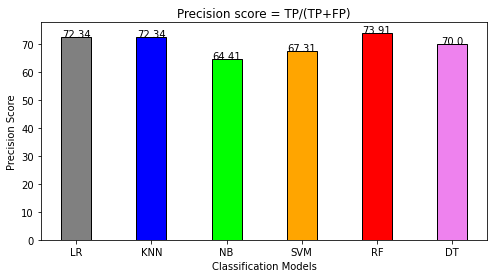
    


```python
# Macro Average Precision Score
Precision_Score = [
          precision_score(y_test, lr_pred, average='macro')*100,
          precision_score(y_test, knn_pred, average='macro')*100, 
          precision_score(y_test, nb_pred, average='macro')*100,
          precision_score(y_test, svm_pred, average='macro')*100,
          precision_score(y_test, rf_pred, average='macro')*100,
          precision_score(y_test, dt_pred, average='macro')*100]

# function to add value labels
def addlabels(x,y):
    for i in range(len(x)):
        plt.text(i, y[i], round(y[i],2), ha = 'center')
# plotting
fig = plt.figure(figsize = (8, 4))
bar_colors = ['grey', 'blue', 'lime', 'orange', 'red', 'violet']
 
# creating the bar plot
plt.bar(models, Precision_Score, color =bar_colors,
        width = 0.4, edgecolor='black')
 
plt.xlabel("Classification Models")
plt.ylabel("Macro Precision Score")
plt.title("Macro Average Precision Score")

# calling the function to add value labels
addlabels(models, Precision_Score)
        
plt.show()
```


    
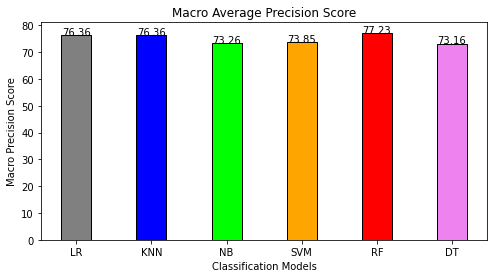
    


```python
# Micro Average Precision Score
Precision_Score = [
          precision_score(y_test, lr_pred, average='micro')*100,
          precision_score(y_test, knn_pred, average='micro')*100, 
          precision_score(y_test, nb_pred, average='micro')*100,
          precision_score(y_test, svm_pred, average='micro')*100,
          precision_score(y_test, rf_pred, average='micro')*100,
          precision_score(y_test, dt_pred, average='micro')*100]

# function to add value labels
def addlabels(x,y):
    for i in range(len(x)):
        plt.text(i, y[i], round(y[i],2), ha = 'center')
# plotting
fig = plt.figure(figsize = (8, 4))
bar_colors = ['grey', 'blue', 'lime', 'orange', 'red', 'violet']
 
# creating the bar plot
plt.bar(models, Precision_Score, color =bar_colors,
        width = 0.4, edgecolor='black')
 
plt.xlabel("Classification Models")
plt.ylabel("Micro Precision Score")
plt.title("Micro Average Precision Score")

# calling the function to add value labels
addlabels(models, Precision_Score)
        
plt.show()
```


    
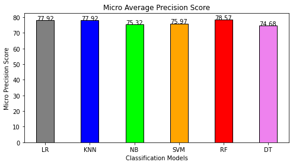
    


```python
# Weighted Average Precision Score
Precision_Score = [
          precision_score(y_test, lr_pred, average='weighted')*100,
          precision_score(y_test, knn_pred, average='weighted')*100, 
          precision_score(y_test, nb_pred, average='weighted')*100,
          precision_score(y_test, svm_pred, average='weighted')*100,
          precision_score(y_test, rf_pred, average='weighted')*100,
          precision_score(y_test, dt_pred, average='weighted')*100]

# function to add value labels
def addlabels(x,y):
    for i in range(len(x)):
        plt.text(i, y[i], round(y[i],2), ha = 'center')
# plotting
fig = plt.figure(figsize = (8, 4))
bar_colors = ['grey', 'blue', 'lime', 'orange', 'red', 'violet']
 
# creating the bar plot
plt.bar(models, Precision_Score, color =bar_colors,
        width = 0.4, edgecolor='black')
 
plt.xlabel("Classification Models")
plt.ylabel("Weighted Precision Score")
plt.title("Weighted Average Precision Score")

# calling the function to add value labels
addlabels(models, Precision_Score)
        
plt.show()
```


    
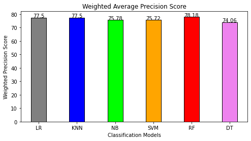
    


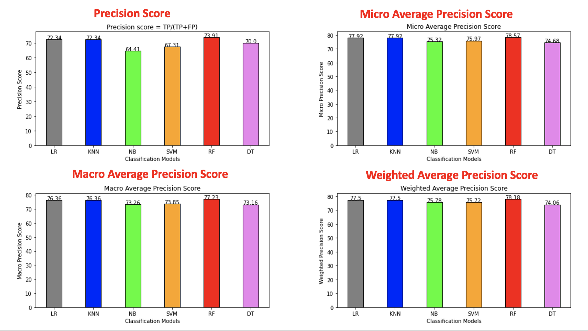


```python
#Recall Score
models = ['LR', 'KNN', 'NB', 'SVM', 'RF', 'DT']
Recall_Score = [
          recall_score(y_test, lr_pred)*100,
          recall_score(y_test, knn_pred)*100, 
          recall_score(y_test, nb_pred)*100,
          recall_score(y_test, svm_pred)*100,
          recall_score(y_test, rf_pred)*100,
          recall_score(y_test, dt_pred)*100]

# function to add value labels
def addlabels(x,y):
    for i in range(len(x)):
        plt.text(i, y[i], round(y[i],2), ha = 'center')
# plotting
fig = plt.figure(figsize = (8, 4))
bar_colors = ['grey', 'blue', 'lime', 'orange', 'red', 'violet']
 
# creating the bar plot
plt.bar(models, Recall_Score, color =bar_colors,
        width = 0.4, edgecolor='black')
 
plt.xlabel("Classification Models")
plt.ylabel("Recall Score")
plt.title("Recall = TP/(TP+FN)")

# calling the function to add value labels
addlabels(models, Recall_Score)
        
plt.show()
```


    
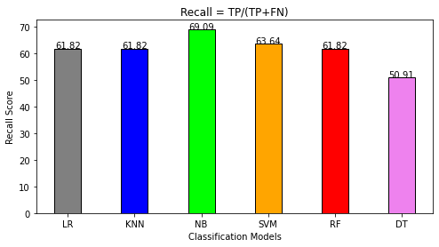
    


```python
#Micro Average Recall Score
models = ['LR', 'KNN', 'NB', 'SVM', 'RF', 'DT']
Recall_Score = [
          recall_score(y_test, lr_pred, average='micro')*100,
          recall_score(y_test, knn_pred, average='micro')*100, 
          recall_score(y_test, nb_pred, average='micro')*100,
          recall_score(y_test, svm_pred, average='micro')*100,
          recall_score(y_test, rf_pred, average='micro')*100,
          recall_score(y_test, dt_pred, average='micro')*100]

# function to add value labels
def addlabels(x,y):
    for i in range(len(x)):
        plt.text(i, y[i], round(y[i],2), ha = 'center')
# plotting
fig = plt.figure(figsize = (8, 4))
bar_colors = ['grey', 'blue', 'lime', 'orange', 'red', 'violet']
 
# creating the bar plot
plt.bar(models, Recall_Score, color =bar_colors,
        width = 0.4, edgecolor='black')
 
plt.xlabel("Classification Models")
plt.ylabel("Micro Recall Score")
plt.title("Micro Average Recall Score")

# calling the function to add value labels
addlabels(models, Recall_Score)
        
plt.show()
```


    
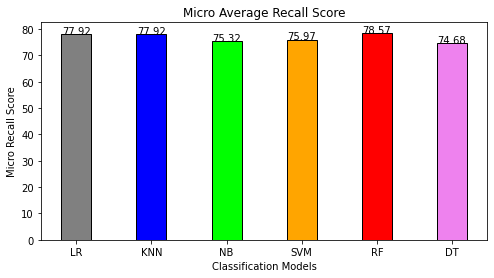
    


```python
#Macro Average Recall Score
models = ['LR', 'KNN', 'NB', 'SVM', 'RF', 'DT']
Recall_Score = [
          recall_score(y_test, lr_pred, average='macro')*100,
          recall_score(y_test, knn_pred, average='macro')*100, 
          recall_score(y_test, nb_pred, average='macro')*100,
          recall_score(y_test, svm_pred, average='macro')*100,
          recall_score(y_test, rf_pred, average='macro')*100,
          recall_score(y_test, dt_pred, average='macro')*100]

# function to add value labels
def addlabels(x,y):
    for i in range(len(x)):
        plt.text(i, y[i], round(y[i],2), ha = 'center')
# plotting
fig = plt.figure(figsize = (8, 4))
bar_colors = ['grey', 'blue', 'lime', 'orange', 'red', 'violet']
 
# creating the bar plot
plt.bar(models, Recall_Score, color =bar_colors,
        width = 0.4, edgecolor='black')
 
plt.xlabel("Classification Models")
plt.ylabel("Macro Recall Score")
plt.title("Macro Average Recall Score")

# calling the function to add value labels
addlabels(models, Recall_Score)
        
plt.show()
```


    
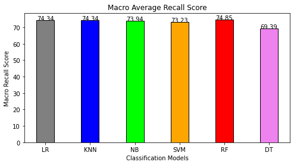
    


```python
#Weighted Average Recall Score
models = ['LR', 'KNN', 'NB', 'SVM', 'RF', 'DT']
Recall_Score = [
          recall_score(y_test, lr_pred, average='weighted')*100,
          recall_score(y_test, knn_pred, average='weighted')*100, 
          recall_score(y_test, nb_pred, average='weighted')*100,
          recall_score(y_test, svm_pred, average='weighted')*100,
          recall_score(y_test, rf_pred, average='weighted')*100,
          recall_score(y_test, dt_pred, average='weighted')*100]

# function to add value labels
def addlabels(x,y):
    for i in range(len(x)):
        plt.text(i, y[i], round(y[i],2), ha = 'center')
# plotting
fig = plt.figure(figsize = (8, 4))
bar_colors = ['grey', 'blue', 'lime', 'orange', 'red', 'violet']
 
# creating the bar plot
plt.bar(models, Recall_Score, color =bar_colors,
        width = 0.4, edgecolor='black')
 
plt.xlabel("Classification Models")
plt.ylabel("Weighted Recall Score")
plt.title("Weighted Average Recall Score")

# calling the function to add value labels
addlabels(models, Recall_Score)
        
plt.show()
```


    
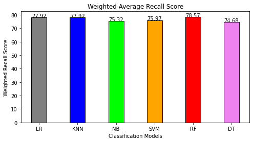
    


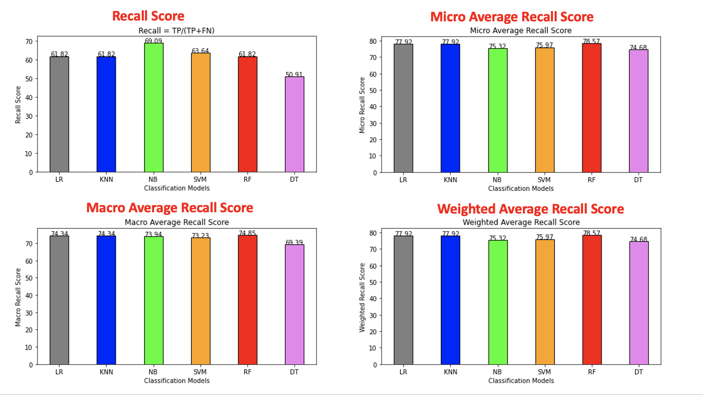


```python
#F1 Score
models = ['LR', 'KNN', 'NB', 'SVM', 'RF', 'DT']
F1_Score = [
          f1_score(y_test, lr_pred)*100,
          f1_score(y_test, knn_pred)*100, 
          f1_score(y_test, nb_pred)*100,
          f1_score(y_test, svm_pred)*100,
          f1_score(y_test, rf_pred)*100,
          f1_score(y_test, dt_pred)*100]

# function to add value labels
def addlabels(x,y):
    for i in range(len(x)):
        plt.text(i, y[i], round(y[i],2), ha = 'center')
# plotting
fig = plt.figure(figsize = (8, 4))
bar_colors = ['grey', 'blue', 'lime', 'orange', 'red', 'violet']
 
# creating the bar plot
plt.bar(models, F1_Score, color =bar_colors,
        width = 0.4, edgecolor='black')
 
plt.xlabel("Classification Models")
plt.ylabel("F1 Score")
plt.title("F1 = 2TP/(2TP +(FP+FN))")

# calling the function to add value labels
addlabels(models, F1_Score)
        
plt.show()
```


    
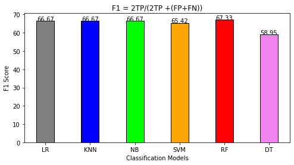
    


```python
#Micro Average F1-Score
models = ['LR', 'KNN', 'NB', 'SVM', 'RF', 'DT']
F1_Score = [
          f1_score(y_test, lr_pred, average='micro')*100,
          f1_score(y_test, knn_pred, average='micro')*100, 
          f1_score(y_test, nb_pred, average='micro')*100,
          f1_score(y_test, svm_pred, average='micro')*100,
          f1_score(y_test, rf_pred, average='micro')*100,
          f1_score(y_test, dt_pred, average='micro')*100]

# function to add value labels
def addlabels(x,y):
    for i in range(len(x)):
        plt.text(i, y[i], round(y[i],2), ha = 'center')
# plotting
fig = plt.figure(figsize = (8, 4))
bar_colors = ['grey', 'blue', 'lime', 'orange', 'red', 'violet']
 
# creating the bar plot
plt.bar(models, F1_Score, color =bar_colors,
        width = 0.4, edgecolor='black')
 
plt.xlabel("Classification Models")
plt.ylabel("Micro F1 Score")
plt.title("Micro Average F1-Score")

# calling the function to add value labels
addlabels(models, F1_Score)
        
plt.show()
```


    
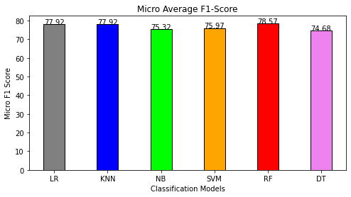
    


```python
#Macro Average F1-Score
models = ['LR', 'KNN', 'NB', 'SVM', 'RF', 'DT']
F1_Score = [
          f1_score(y_test, lr_pred, average='macro')*100,
          f1_score(y_test, knn_pred, average='macro')*100, 
          f1_score(y_test, nb_pred, average='macro')*100,
          f1_score(y_test, svm_pred, average='macro')*100,
          f1_score(y_test, rf_pred, average='macro')*100,
          f1_score(y_test, dt_pred, average='macro')*100]

# function to add value labels
def addlabels(x,y):
    for i in range(len(x)):
        plt.text(i, y[i], round(y[i],2), ha = 'center')
# plotting
fig = plt.figure(figsize = (8, 4))
bar_colors = ['grey', 'blue', 'lime', 'orange', 'red', 'violet']
 
# creating the bar plot
plt.bar(models, F1_Score, color =bar_colors,
        width = 0.4, edgecolor='black')
 
plt.xlabel("Classification Models")
plt.ylabel("Macro F1 Score")
plt.title("Macro Average F1-Score")

# calling the function to add value labels
addlabels(models, F1_Score)
        
plt.show()
```


    
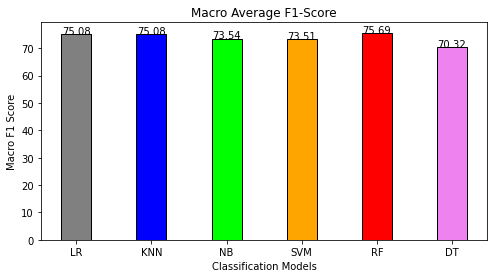
    


```python
#Weighted Average F1-Score
models = ['LR', 'KNN', 'NB', 'SVM', 'RF', 'DT']
F1_Score = [
          f1_score(y_test, lr_pred, average='weighted')*100,
          f1_score(y_test, knn_pred, average='weighted')*100, 
          f1_score(y_test, nb_pred, average='weighted')*100,
          f1_score(y_test, svm_pred, average='weighted')*100,
          f1_score(y_test, rf_pred, average='weighted')*100,
          f1_score(y_test, dt_pred, average='weighted')*100]

# function to add value labels
def addlabels(x,y):
    for i in range(len(x)):
        plt.text(i, y[i], round(y[i],2), ha = 'center')
# plotting
fig = plt.figure(figsize = (8, 4))
bar_colors = ['grey', 'blue', 'lime', 'orange', 'red', 'violet']
 
# creating the bar plot
plt.bar(models, F1_Score, color =bar_colors,
        width = 0.4, edgecolor='black')
 
plt.xlabel("Classification Models")
plt.ylabel("Weighted F1 Score")
plt.title("Weighted Average F1-Score")

# calling the function to add value labels
addlabels(models, F1_Score)
        
plt.show()
```


    
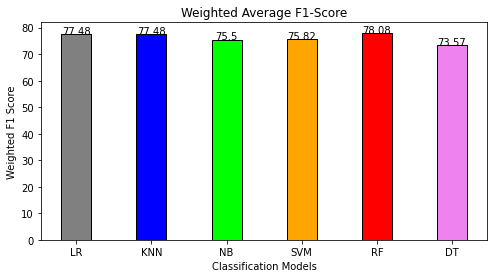
    


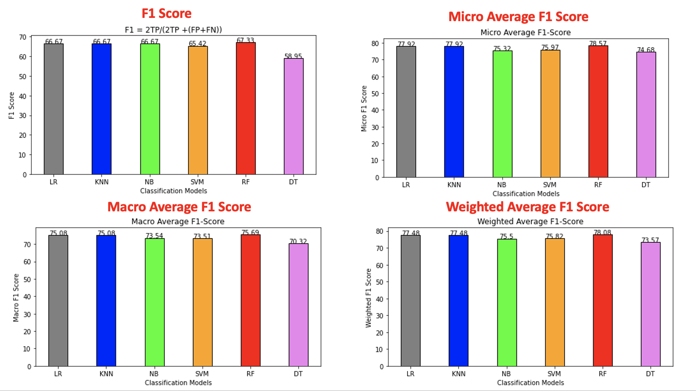

## 5.3.3 ROC Curve & ROC AUC

> It is comparison of two main characteristics (**TPR** and **FPR**)

### 5.3.3.1 Logistic regression


```python
# Area Under Curve of Logistic regression
auc_lr = roc_auc_score(y_test, lr_pred)
print("ROC AUC score of Logistic Regration is: ", auc_lr)
```

    ROC AUC score of Logistic Regration is:  0.7434343434343434


```python
plt=reload(plt)
fpr, tpr, thresholds = roc_curve(y_test, lr_pred)
plt.plot(fpr, tpr, color='orange', label='ROC')
plt.plot([0,1], [0,1], color='darkblue', linestyle='--', label='ROC Curve (area=%0.2f)'%auc_lr)
plt.xlabel('false Positive Rate')
plt.ylabel('True Positive Rate')
plt.title("ROC Curve of Logistic Regression")
plt.legend()
plt.grid()
plt.show()
```


    

    


### 5.3.3.2 K-Nearest Neighbors


```python
# Area Under Curve of K-Nearest Neighbors
auc_knn = roc_auc_score(y_test, knn_pred)
print("ROC AUC score of K-Nearest Neighbors is: ", auc_knn)
```

    ROC AUC score of K-Nearest Neighbors is:  0.7434343434343434


```python
plt=reload(plt)
fpr, tpr, thresholds = roc_curve(y_test, knn_pred)
plt.plot(fpr, tpr, color='orange', label='ROC')
plt.plot([0,1], [0,1], color='darkblue', linestyle='--', label='ROC Curve (area=%0.2f)'%auc_knn)
plt.xlabel('false Positive Rate')
plt.ylabel('True Positive Rate')
plt.title("ROC Curve of K-Nearest Neighbors")
plt.legend()
plt.grid()
plt.show()
```


    

    


### 5.3.3.3 Naïve Bayes


```python
# Area Under Curve of Naïve Bayes
auc_nb = roc_auc_score(y_test, nb_pred)
print("ROC AUC score of Naïve Bayes is: ", auc_nb)
```

    ROC AUC score of Naïve Bayes is:  0.7393939393939394


```python
plt=reload(plt)
fpr, tpr, thresholds = roc_curve(y_test,nb_pred)
plt.plot(fpr, tpr, color='orange', label='ROC')
plt.plot([0,1], [0,1], color='darkblue', linestyle='--', label='ROC Curve (area=%0.2f)'%auc_nb)
plt.xlabel('false Positive Rate')
plt.ylabel('True Positive Rate')
plt.title("ROC Curve of Naïve Bayes")
plt.legend()
plt.grid()
plt.show()
```


    
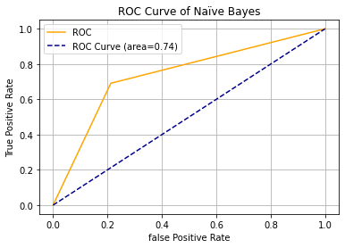
    


### 5.3.3.4 Support Vector Machine


```python
# Area Under Curve of Support Vector Machine
auc_svm = roc_auc_score(y_test, svm_pred)
print("ROC AUC score of Support Vector Machine is: ", auc_svm)
```

    ROC AUC score of Support Vector Machine is:  0.7323232323232323


```python
plt=reload(plt)
fpr, tpr, thresholds = roc_curve(y_test,svm_pred)
plt.plot(fpr, tpr, color='orange', label='ROC')
plt.plot([0,1], [0,1], color='darkblue', linestyle='--', label='ROC Curve (area=%0.2f)'%auc_svm)
plt.xlabel('false Positive Rate')
plt.ylabel('True Positive Rate')
plt.title("ROC Curve of Support Vector Machine")
plt.legend()
plt.grid()
plt.show()
```


    
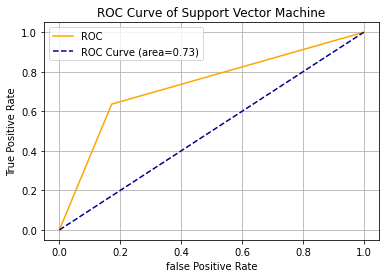
    


### 5.3.3.5 Random Forest


```python
# Area Under Curve of Random Forest
auc_rf = roc_auc_score(y_test, rf_pred)
print("ROC AUC score of Random Forest is: ", auc_rf)
```

    ROC AUC score of Random Forest is:  0.7484848484848484


```python
plt=reload(plt)
fpr, tpr, thresholds = roc_curve(y_test,rf_pred)
plt.plot(fpr, tpr, color='orange', label='ROC')
plt.plot([0,1], [0,1], color='darkblue', linestyle='--', label='ROC Curve (area=%0.2f)'%auc_rf)
plt.xlabel('false Positive Rate')
plt.ylabel('True Positive Rate')
plt.title("ROC Curve of Random Forest")
plt.legend()
plt.grid()
plt.show()
```


    
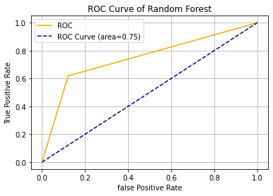
    


### 5.3.3.6 Decision Tree


```python
# Area Under Curve of Decision Tree
auc_dt = roc_auc_score(y_test, dt_pred)
print("ROC AUC score of Decision Tree is: ", auc_dt)
```

    ROC AUC score of Decision Tree is:  0.6939393939393939


```python
plt=reload(plt)
fpr, tpr, thresholds = roc_curve(y_test,dt_pred)
plt.plot(fpr, tpr, color='orange', label='ROC')
plt.plot([0,1], [0,1], color='darkblue', linestyle='--', label='ROC Curve (area=%0.2f)'%auc_dt)
plt.xlabel('false Positive Rate')
plt.ylabel('True Positive Rate')
plt.title("ROC Curve of Decision Tree")
plt.legend()
plt.grid()
plt.show()
```


    

    


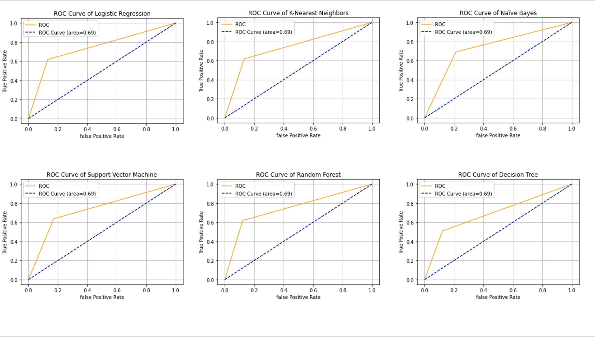


```python

```
